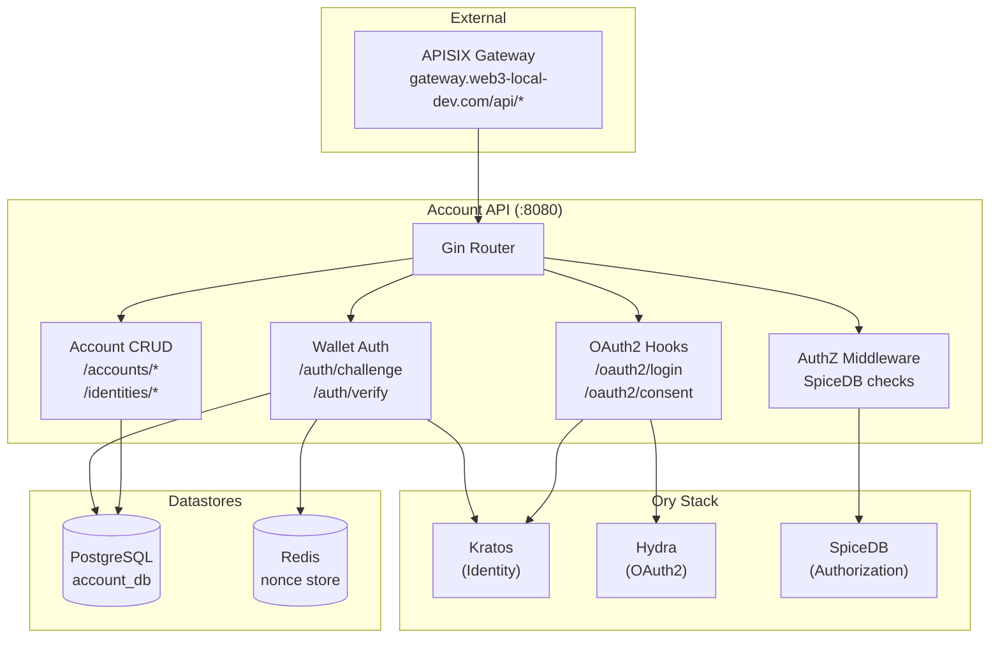
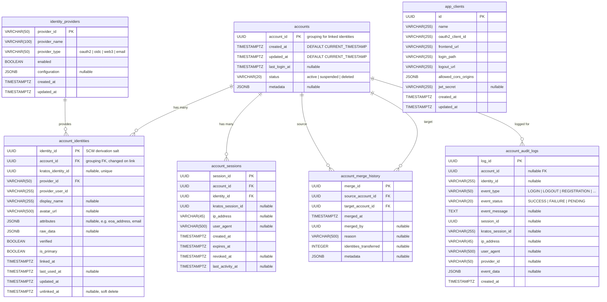

# Account API — Architecture & Database Schema

The Account API is a Go/Gin backend service that acts as the central control plane between Web3 wallets, the Ory identity stack (Kratos, Hydra, Oathkeeper), AuthZed SpiceDB, and the shared PostgreSQL datastore. It is deployed as `web3-account-api` in the `web3` namespace.

## High-Level Architecture



## Database Schema (PostgreSQL)

The Account API owns the `account_db` database on the shared PostgreSQL instance. Schema is managed via `golang-migrate/migrate` with migration files in `Account-System/migrations/postgres/`.

### Entity Relationship Diagram



### Type Mapping (Spanner → PostgreSQL)

| Spanner Type | PostgreSQL Type | Notes |
|---|---|---|
| `STRING(36)` (UUIDs) | `UUID` | Native UUID type with `gen_random_uuid()` |
| `STRING(x)` | `VARCHAR(x)` | Length-constrained strings |
| `STRING(MAX)` | `TEXT` | Unbounded text |
| `TIMESTAMP OPTIONS(allow_commit_timestamp)` | `TIMESTAMPTZ DEFAULT CURRENT_TIMESTAMP` | Auto-set on insert |
| `JSON` | `JSONB` | Binary JSON for indexing |
| `BOOL` | `BOOLEAN` | Direct mapping |
| `INT64` | `INTEGER` | Standard integer |

### Key Indexes

| Table | Index | Columns | Notes |
|---|---|---|---|
| `accounts` | `idx_accounts_status` | `status` | Filter by status |
| `account_identities` | `idx_account_identities_provider_user` | `provider_id, provider_user_id` | **UNIQUE** — prevents duplicate provider accounts |
| `account_identities` | `idx_account_identities_kratos_id` | `kratos_identity_id` | **UNIQUE** — one Kratos identity per mapping |
| `account_sessions` | `idx_account_sessions_kratos_session_id` | `kratos_session_id` | Lookup by Kratos session |
| `account_audit_logs` | `idx_account_audit_logs_failed_attempts` | `event_status, event_type, created_at DESC` | Security analysis with `INCLUDE (ip_address, identity_id)` |

## Code Generation (SQLC)

All database queries are defined in `internal/database/query.sql` and compiled by [`sqlc`](https://sqlc.dev/) into type-safe Go code using `pgx/v5`:

```
Account-System/
├── sqlc.yaml                      # SQLC config
├── internal/database/
│   ├── query.sql                  # SQL query definitions
│   ├── postgres/                  # Auto-generated by sqlc
│   │   ├── db.go                  # DBTX interface
│   │   ├── models.go              # Go structs from schema
│   │   └── query.sql.go           # Type-safe query functions
│   ├── repository.go              # AccountRepository interface
│   ├── redis/                     # Nonce storage (unchanged)
│   └── spicedb/                   # Authorization client (unchanged)
```

The generated `Queries` struct is wrapped by a `Repository` implementation that satisfies the existing `AccountRepository` interface, ensuring handler code requires minimal changes.
