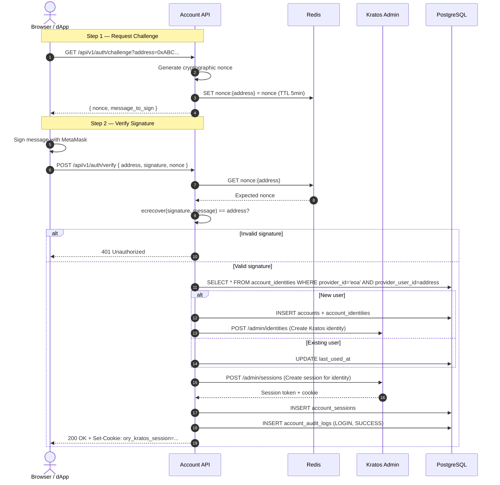
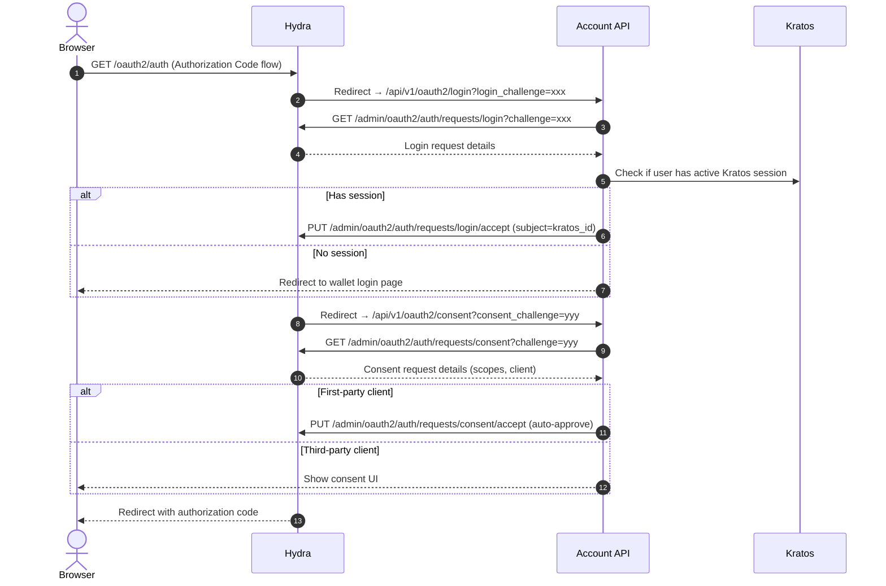

# Account API — Endpoints & Flows

The Account API exposes endpoints under `/api/v1/` through the APISIX gateway at `gateway.web3-local-dev.com/api/*`. The `proxy-rewrite` plugin strips the `/api` prefix before forwarding to the service on port 8080.

## Route Summary

| Method   | Gateway Path                      | API Internal Path                 | Description                   | Auth     |
| -------- | --------------------------------- | --------------------------------- | ----------------------------- | -------- |
| `GET`    | `/api/v1/auth/challenge`          | `/api/v1/auth/challenge`          | Get wallet sign challenge     | Public   |
| `POST`   | `/api/v1/auth/verify`             | `/api/v1/auth/verify`             | Verify wallet signature       | Public   |
| `GET`    | `/api/v1/accounts/:id`            | `/api/v1/accounts/:id`            | Get account by ID             | Session  |
| `GET`    | `/api/v1/accounts/:id/identities` | `/api/v1/accounts/:id/identities` | List linked identities        | Session  |
| `POST`   | `/api/v1/accounts/:id/identities` | `/api/v1/accounts/:id/identities` | Link new identity             | Session  |
| `DELETE` | `/api/v1/identities/:id`          | `/api/v1/identities/:id`          | Unlink identity (soft delete) | Session  |
| `GET`    | `/api/v1/oauth2/login`            | `/api/v1/oauth2/login`            | Hydra login webhook           | Internal |
| `GET`    | `/api/v1/oauth2/consent`          | `/api/v1/oauth2/consent`          | Hydra consent webhook         | Internal |
| `GET`    | `/api/health`                     | `/api/health`                     | Health check                  | Public   |
| `POST`   | `/api/v1/admin/clients`           | `/api/v1/admin/clients`           | Create App Client             | Admin    |
| `GET`    | `/api/v1/admin/clients`           | `/api/v1/admin/clients`           | List App Clients              | Admin    |
| `GET`    | `/api/v1/admin/clients/:id`       | `/api/v1/admin/clients/:id`       | Get App Client by ID          | Admin    |
| `PUT`    | `/api/v1/admin/clients/:id`       | `/api/v1/admin/clients/:id`       | Update App Client             | Admin    |
| `DELETE` | `/api/v1/admin/clients/:id`       | `/api/v1/admin/clients/:id`       | Delete App Client             | Admin    |

## Flow 1: Wallet Authentication (Challenge-Verify)

This is the primary Web3-native login flow. The user proves wallet ownership via cryptographic signature.



### Challenge Request

```
GET /api/v1/auth/challenge?address=0xABC123...
```

**Response** (200):

```json
{
  "nonce": "a1b2c3d4e5f6",
  "message": "web3-lab wants you to sign in with your Ethereum account:\n0xABC123...\n\nSign this message to authenticate.\n\nURI: https://gateway.web3-local-dev.com\nVersion: 1\nChain ID: 1\nNonce: a1b2c3d4e5f6\nIssued At: 2026-03-21T12:00:00Z"
}
```

### Verify Signature

```
POST /api/v1/auth/verify
Content-Type: application/json
```

**Request**:

```json
{
  "address": "0xABC123...",
  "signature": "0xdeadbeef...",
  "nonce": "a1b2c3d4e5f6"
}
```

**Response** (200):

```json
{
  "account_id": "550e8400-e29b-41d4-a716-446655440000",
  "session_token": "ory_st_..."
}
```

## Flow 2: OAuth2 Bridge (Hydra Login/Consent)

The API implements Hydra's Login and Consent webhooks to bridge wallet-authenticated Kratos sessions into standard OAuth2 tokens.



## Flow 3: Account & Identity Management

### Get Account

```
GET /api/v1/accounts/:account_id
Authorization: Bearer <kratos_session_token>
```

### List Linked Identities

```
GET /api/v1/accounts/:account_id/identities
Authorization: Bearer <kratos_session_token>
```

**Response** (200):

```json
{
  "identities": [
    {
      "identity_id": "...",
      "provider_id": "eoa",
      "provider_user_id": "0xABC...",
      "display_name": "MetaMask Wallet",
      "verified": true,
      "is_primary": true,
      "linked_at": "2026-03-21T12:00:00Z"
    },
    {
      "identity_id": "...",
      "provider_id": "google",
      "provider_user_id": "user@gmail.com",
      "verified": true,
      "is_primary": false,
      "linked_at": "2026-03-22T08:00:00Z"
    }
  ]
}
```

### Unlink Identity (Soft Delete)

```
DELETE /api/v1/identities/:identity_id
Authorization: Bearer <kratos_session_token>
```

Sets `unlinked_at` timestamp instead of hard deleting.

## Error Responses

All errors follow a consistent format:

```json
{
  "error": {
    "code": "INVALID_SIGNATURE",
    "message": "The provided signature does not match the address",
    "request_id": "req_abc123"
  }
}
```

| HTTP Status | Code                      | Description                                     |
| ----------- | ------------------------- | ----------------------------------------------- |
| 400         | `INVALID_REQUEST`         | Malformed request body or missing params        |
| 401         | `INVALID_SIGNATURE`       | Wallet signature verification failed            |
| 401         | `SESSION_EXPIRED`         | Kratos session is no longer valid               |
| 403         | `FORBIDDEN`               | SpiceDB permission check denied                 |
| 404         | `NOT_FOUND`               | Account or identity not found                   |
| 409         | `IDENTITY_ALREADY_LINKED` | Provider+user already linked to another account |
| 429         | `RATE_LIMITED`            | APISIX rate limit exceeded                      |
