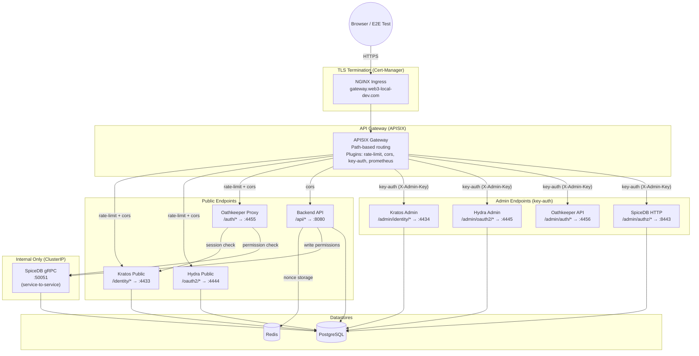
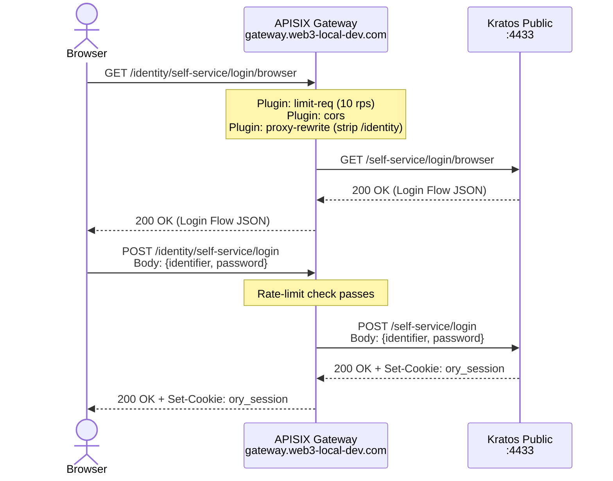
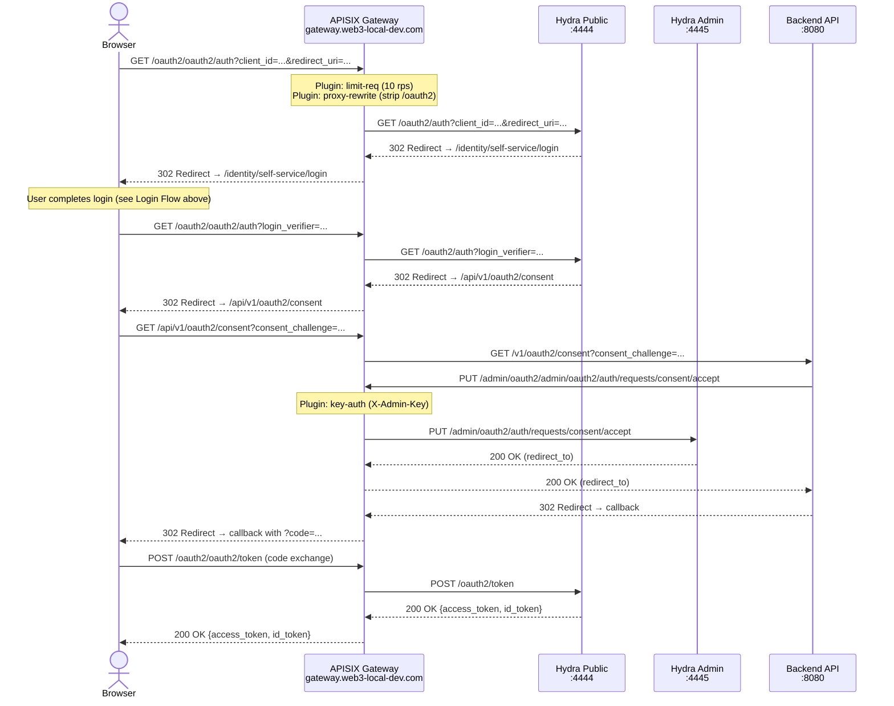
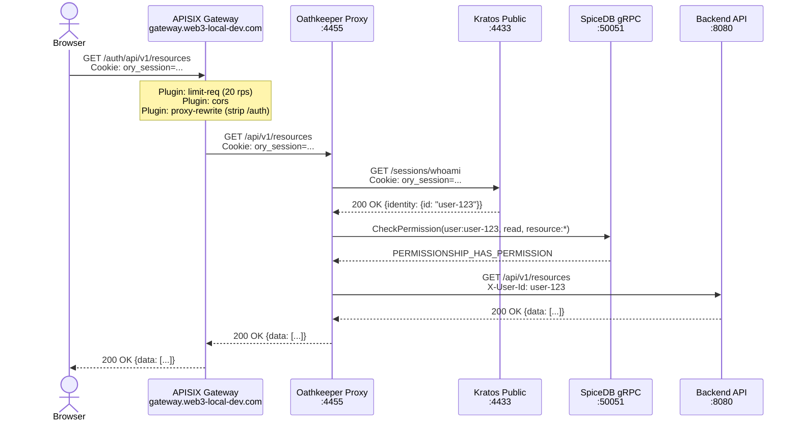
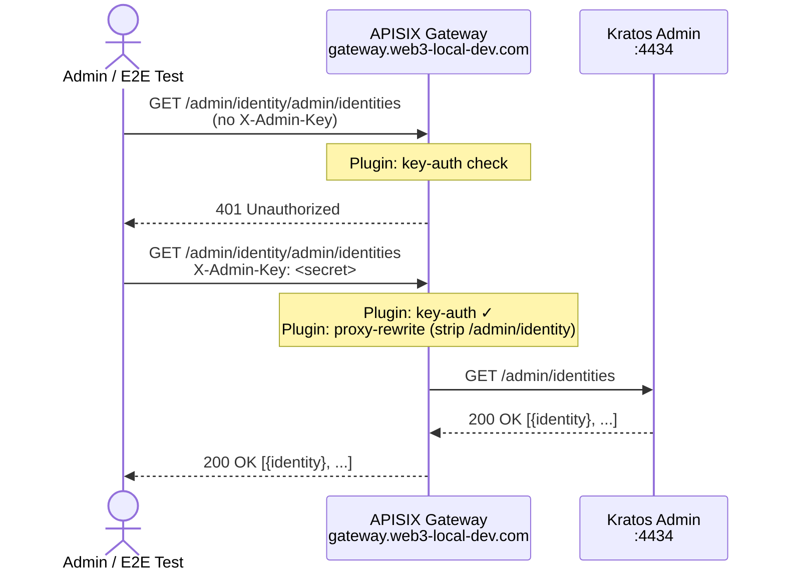
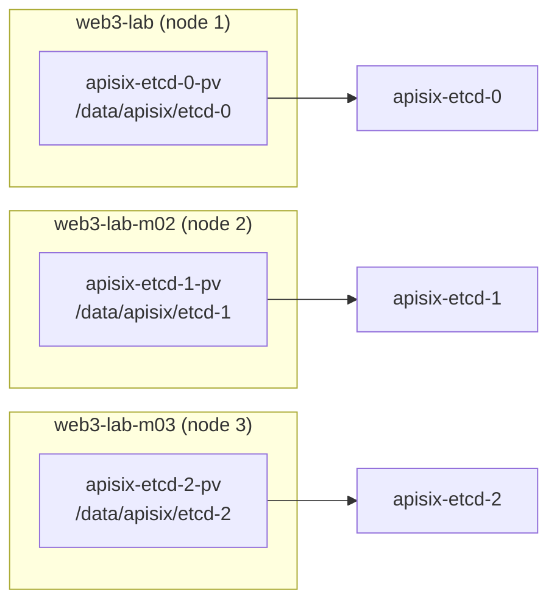
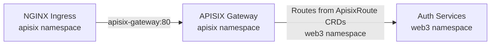

# APISIX Auth Gateway Architecture

This document describes the architecture for using Apache APISIX as a unified API gateway in front of the Identity & Authorization Stack (Ory Kratos, Hydra, Oathkeeper, AuthZed SpiceDB).

## High-Level Architecture

All external traffic enters through a single TLS-terminated gateway host (`gateway.web3-local-dev.com`). APISIX routes requests by path prefix to internal ClusterIP services, applying plugins (rate limiting, CORS, key-auth, Prometheus) at the gateway layer.



## Request Routing

APISIX uses the `proxy-rewrite` plugin to strip path prefixes before forwarding to upstream services.

| Incoming Request                       | Strip Prefix      | Upstream Receives         | Service          |
| -------------------------------------- | ----------------- | ------------------------- | ---------------- |
| `GET /identity/self-service/login`     | `/identity`       | `GET /self-service/login` | Kratos Public    |
| `POST /oauth2/token`                   | `/oauth2`         | `POST /token`             | Hydra Public     |
| `GET /auth/api/v1/users`               | `/auth`           | `GET /api/v1/users`       | Oathkeeper Proxy |
| `GET /api/v1/health`                   | `/api`            | `GET /v1/health`          | Backend API      |
| `GET /admin/identity/admin/identities` | `/admin/identity` | `GET /admin/identities`   | Kratos Admin     |
| `POST /admin/oauth2/admin/clients`     | `/admin/oauth2`   | `POST /admin/clients`     | Hydra Admin      |
| `GET /admin/authz/v1/schema`           | `/admin/authz`    | `GET /v1/schema`          | SpiceDB HTTP     |

## Sequence Diagrams

### Login Flow (Kratos via APISIX)



### OAuth2 Authorization Code Flow (Hydra via APISIX)



### Protected API Access (Oathkeeper + SpiceDB)



### Admin API Access (Key-Auth)



### Health Path Mapping

Each service has a different health endpoint. The `proxy-rewrite` plugin strips the gateway prefix:

| Gateway Path                         | Rewrites to           | Service        | Port |
| ------------------------------------ | --------------------- | -------------- | ---- |
| `/identity/health/alive`             | `/health/alive`       | kratos-public  | 4433 |
| `/oauth2/health/alive`               | `/health/alive`       | hydra-public   | 4444 |
| `/api/health`                        | `/health`             | web3-api       | 8080 |
| `/admin/identity/admin/health/alive` | `/admin/health/alive` | kratos-admin   | 4434 |
| `/admin/oauth2/health/alive`         | `/health/alive`       | hydra-admin    | 4445 |
| `/admin/auth/health/alive`           | `/health/alive`       | oathkeeper-api | 4456 |

> [!NOTE]
> Kratos admin health is at `/admin/health/alive` (not `/health/alive`). Hydra and Oathkeeper use `/health/alive` on both public and admin ports. The Oathkeeper proxy (port 4455, route `/auth/*`) does **not** have a health endpoint — use `/admin/auth/health/alive` instead.

## Plugin Configuration Summary

### Public Routes

```yaml
plugins:
  - name: limit-req
    enable: true
    config:
      rate: 10 # requests per second
      burst: 5 # burst allowance
      key: remote_addr
      rejected_code: 429
  - name: cors
    enable: true
    config:
      allow_origins: "https://gateway.web3-local-dev.com,http://localhost:3000"
      allow_methods: "GET,POST,PUT,DELETE,OPTIONS"
      allow_headers: "Content-Type,Authorization,X-Session-Token,X-CSRF-Token"
      allow_credential: true
  - name: proxy-rewrite
    enable: true
    config:
      regex_uri: ["^/identity/(.*)", "/$1"] # per-route prefix
  - name: prometheus
    enable: true
    config:
      prefer_name: true
```

### Admin Routes

```yaml
plugins:
  - name: key-auth
    enable: true
    config:
      header: X-Admin-Key
  - name: proxy-rewrite
    enable: true
    config:
      regex_uri: ["^/admin/identity/(.*)", "/$1"] # per-route prefix
  - name: prometheus
    enable: true
    config:
      prefer_name: true
```

## Infrastructure & Installation

### etcd Storage

APISIX uses etcd as its config store. On Minikube, each etcd replica needs a `PersistentVolume` with `hostPath` pinned to a specific node via `nodeAffinity`:



### Helm Values

Key configuration in `deployments/helm/apisix-values.yaml`:

| Setting                                   | Value           | Reason                                            |
| ----------------------------------------- | --------------- | ------------------------------------------------- |
| `gateway.type`                            | `ClusterIP`     | Behind NGINX Ingress, no direct external exposure |
| `etcd.volumePermissions.enabled`          | `true`          | Fixes `/bitnami/etcd/data` permission on hostPath |
| `etcd.volumePermissions.image.repository` | `debian`        | Default `bitnami/os-shell` tag doesn't exist      |
| `etcd.volumePermissions.image.tag`        | `bookworm-slim` | Explicit tag to prevent chart suffix collision    |
| `global.security.allowInsecureImages`     | `true`          | Allows non-Bitnami `debian` image                 |
| `apisix.prometheus.enabled`               | `true`          | Exposes `/apisix/prometheus/metrics`              |

### Cross-Namespace Bridging

The NGINX Ingress and gateway Ingress are in the `apisix` namespace (same as `apisix-gateway` service). ApisixRoute CRDs are in the `web3` namespace. The APISIX Ingress Controller watches all namespaces.

> [!IMPORTANT]
> ExternalName services do **not** work with NGINX Ingress Controller — the internal lua DNS resolver fails to resolve them. The gateway Ingress must be in the same namespace as the `apisix-gateway` Service.



### Post-Install Configuration

APISIX Ingress Controller 2.0+ requires two post-install steps before routes sync:

1. **GatewayProxy CRD** — tells the controller how to connect to the APISIX Admin API
2. **IngressClass patch** — links the IngressClass `apisix` to the GatewayProxy

Both are automated in `make apisix-install`.

### Consumer Configuration

> [!IMPORTANT]
> `ApisixConsumer` CRDs **must** include `ingressClassName: apisix` in the spec. Without it, the controller ignores the consumer during ADC sync, and any manually-created consumers get deleted by the sync cycle.
>
> The consumer is deployed via `make deploy-apisix-auth-gateway` as part of the kustomize apply.

## Migration Checklist

When migrating from per-service NGINX Ingress to unified APISIX gateway:

1. ✅ Install APISIX — `make apisix-install`
2. ✅ Deploy APISIX route manifests — `make deploy-apisix-auth-gateway`
3. ⬜ Update Hydra/Kratos public base URLs to `gateway.web3-local-dev.com` paths
4. ✅ Update `/etc/hosts` to add `127.0.0.1 gateway.web3-local-dev.com`
5. ⬜ Delete old per-service Ingress resources
6. ✅ Run `make tls-setup` to trust new certificate
7. ✅ Verify public endpoints → 503 (routing works, upstream down)
8. ✅ Verify admin key-auth → 401 without key, 503 with key (auth passed)
