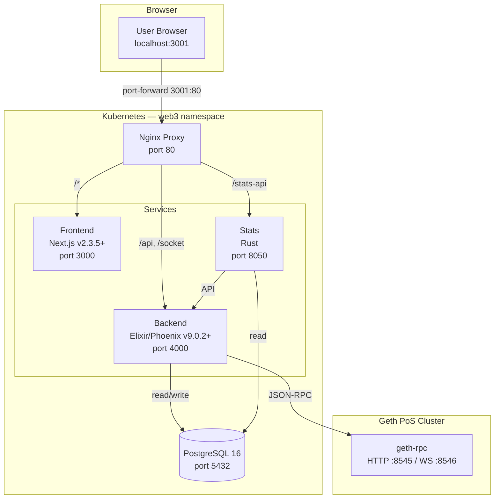
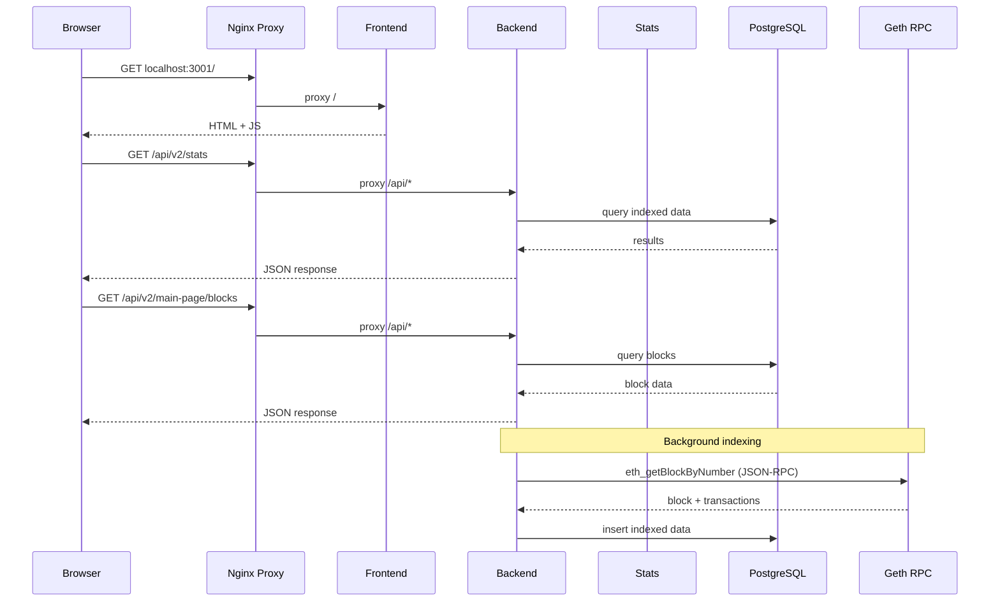
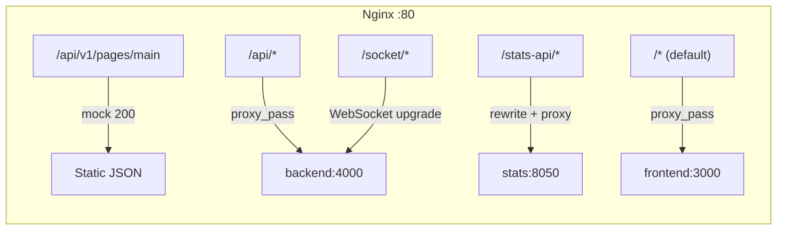
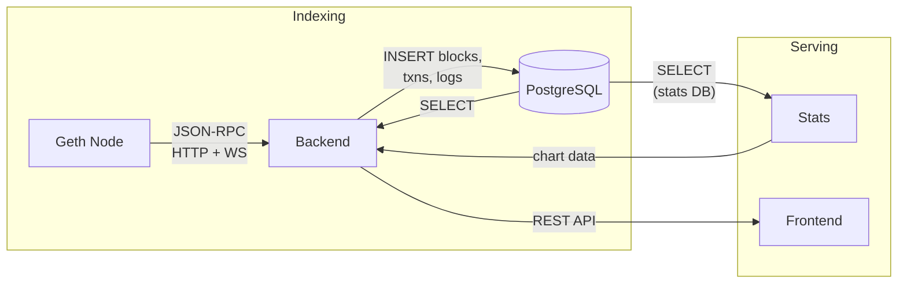
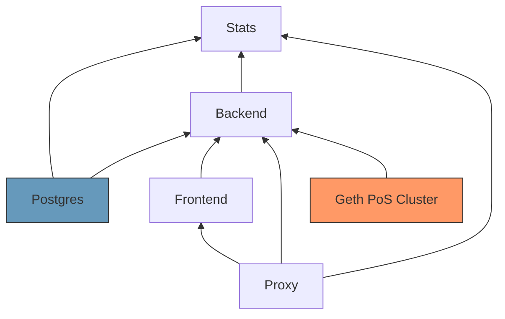

# Blockscout Explorer — Architecture

## Overview

Blockscout is an open-source EVM blockchain explorer deployed on Kubernetes. It indexes blockchain data from the Geth PoS cluster and serves it through a web UI.

## Component Architecture



## Request Flow



## Components

| Component    | Image                                  | Role                                   |
| ------------ | -------------------------------------- | -------------------------------------- |
| **Postgres** | `postgres:16-alpine`                   | Shared database (blockscout + stats)   |
| **Backend**  | `ghcr.io/blockscout/blockscout:latest` | Indexer + REST/WS API (Elixir/Phoenix) |
| **Frontend** | `ghcr.io/blockscout/frontend:latest`   | Web UI (Next.js SSR)                   |
| **Stats**    | `ghcr.io/blockscout/stats:latest`      | Chart/analytics service (Rust)         |
| **Proxy**    | `nginx:alpine`                         | Reverse proxy — single entry point     |

> [!IMPORTANT]
> Backend and Frontend versions must be compatible. Backend v9.x pairs with Frontend v2.x. The Docker Hub `blockscout/blockscout:latest` image is outdated (v7.0.2) — always use `ghcr.io/blockscout/blockscout:latest`.

## Nginx Proxy Routing

The proxy eliminates CORS issues by serving all components on a single origin:



| Path               | Destination            | Notes                                    |
| ------------------ | ---------------------- | ---------------------------------------- |
| `/api/v1/pages/main` | Mock 200 response    | Legacy endpoint removed in backend v9    |
| `/api/*`           | `backend:4000`         | All REST API calls                       |
| `/socket/*`        | `backend:4000`         | WebSocket with connection upgrade        |
| `/stats-api/*`     | `stats:8050`           | Path rewritten (`/stats-api/x` → `/x`)  |
| `/*`               | `frontend:3000`        | Default — serves the Next.js UI          |

## Data Flow



The backend continuously indexes the chain via JSON-RPC:

1. **Block fetcher** — polls `eth_getBlockByNumber` for new blocks
2. **Transaction fetcher** — fetches full transaction details + receipts
3. **Internal transaction tracer** — calls `debug_traceTransaction` for internal txns
4. **Token indexer** — detects ERC-20/721/1155 transfers from event logs

## Kubernetes Manifests

```
deployments/kubernetes/minikube/blockscout/
├── postgres.yaml    # StatefulSet + PVC + Service (port 5432)
├── blockscout.yaml  # Backend Deployment + Service (port 4000)
├── frontend.yaml    # Frontend Deployment + Service (port 3000)
├── stats.yaml       # Stats Deployment + Service (port 8050)
└── proxy.yaml       # Nginx ConfigMap + Deployment + Service (port 80)
```

## Database Schema

PostgreSQL hosts two logical databases:

| Database           | Used By          | Contents                                   |
| ------------------ | ---------------- | ------------------------------------------ |
| `blockscout`       | Backend          | Blocks, transactions, addresses, tokens    |
| `blockscout_stats` | Stats            | Aggregated chart data, daily metrics       |

Both databases are created automatically on first startup via `CREATE_DATABASE=true` and `STATS__CREATE_DATABASE=true`.

## Dependencies



Blockscout requires:

- **Geth PoS cluster** running and producing blocks
- **PostgreSQL** for persistent storage
- **All 5 pods** healthy before the UI is fully functional
