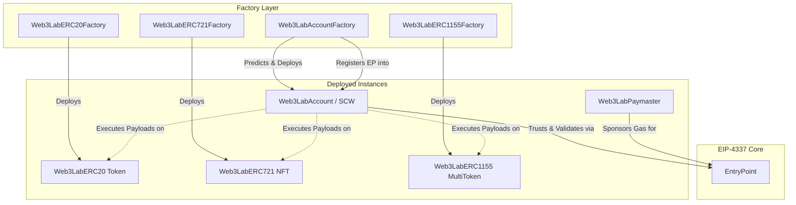
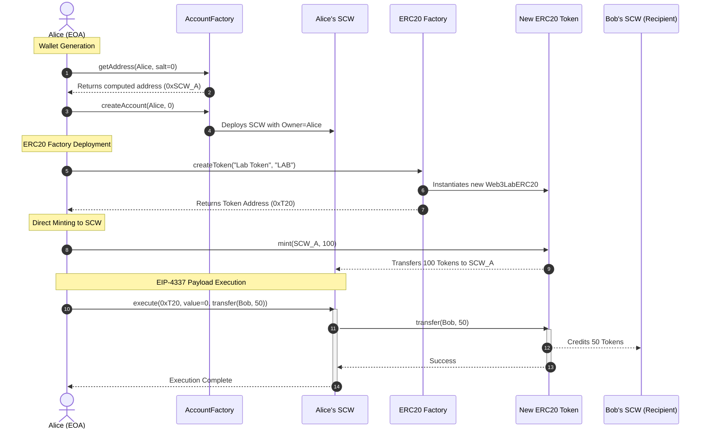

# Web3Lab Smart Contract Architecture

This document outlines the high-level architecture of the Web3Lab Smart Contract stack, specifically highlighting the Factory Deployment models and the EIP-4337 Account Abstraction execution layers.

## 1. Directory Structure

To adhere to industry-standard EVM development patterns, the contracts are strictly separated into discrete standard directories:

```text
contracts/
├── contracts/
│   ├── erc4337/
│   │   ├── Web3LabEntryPoint.sol       (EIP-4337 Core)
│   │   ├── Web3LabAccount.sol          (Smart Contract Wallet)
│   │   ├── Web3LabAccountFactory.sol   (SCW Generator)
│   │   └── Web3LabPaymaster.sol        (Gas Sponsorship)
│   ├── erc20/
│   │   ├── Web3LabERC20.sol
│   │   └── Web3LabERC20Factory.sol
│   ├── erc721/
│   │   ├── Web3LabERC721.sol
│   │   └── Web3LabERC721Factory.sol
│   └── erc1155/
│       ├── Web3LabERC1155.sol
│       └── Web3LabERC1155Factory.sol
```

## 2. High-Level Dependency Graph (Top-Bottom)



## 3. Interaction Sequence: SCW Wallet Creation & Asset Transfer

The integration tests and application backend interact with the Smart Contracts solely by executing internal calls via the proxy nature of the SCW. The following sequence demonstrates Wallet creation and subsequent ERC-20 token execution.


