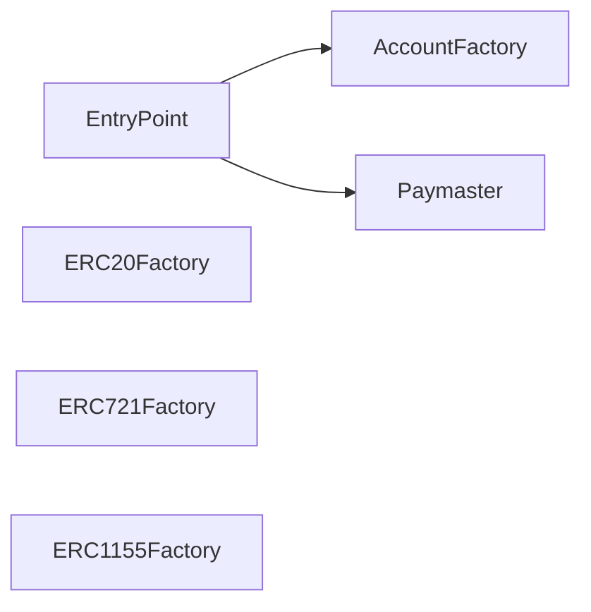

# Smart Contract — Operations

> See [architecture.md](architecture.md) for contract structure and dependency diagrams.

## Prerequisites

- Geth PoS cluster running and producing blocks
- Port-forward active: `make port-forward-geth-rpc` (localhost:8545)
- Node dependencies installed: `pixi run npm install --workspace=contracts`

## Full Deployment (Fresh Chain)

```bash
# 1. Compile all Solidity contracts
make compile-contracts

# 2. Deploy core infrastructure (EntryPoint, Factories, Paymaster)
make deploy-contracts

# 3. Run interaction test (deploys test tokens, SCWs, and transfers)
make test-interact
```

### Step Breakdown

| Step | Target              | What It Does                                                                  | Output File                   |
| ---- | ------------------- | ----------------------------------------------------------------------------- | ----------------------------- |
| 1    | `compile-contracts` | Compiles `.sol` files via Hardhat (Solidity 0.8.28, optimizer enabled, viaIR) | `contracts/artifacts/`        |
| 2    | `deploy-contracts`  | Deploys 6 core contracts to `localGeth` (chain ID 72390)                      | `contracts/deployments.json`  |
| 3    | `test-interact`     | Creates SCWs, mints & transfers ERC-20/721/1155 tokens                        | `contracts/seed-addresses.json` |

## Deployment Script (`deploy.js`)

Deploys contracts in dependency order:



| Contract                 | Constructor Args          | Purpose                          |
| ------------------------ | ------------------------- | -------------------------------- |
| `Web3LabEntryPoint`      | —                         | EIP-4337 singleton entry point   |
| `Web3LabAccountFactory`  | `entryPointAddr`          | Deterministic SCW deployer       |
| `Web3LabERC20Factory`    | —                         | Creates ERC-20 token instances   |
| `Web3LabERC721Factory`   | —                         | Creates ERC-721 NFT instances    |
| `Web3LabERC1155Factory`  | —                         | Creates ERC-1155 multi-token instances |
| `Web3LabPaymaster`       | `entryPointAddr`, `owner` | Gas sponsorship                  |

Addresses are written to `contracts/deployments.json` — used by `test-interact.js`.

## Interaction Test (`test-interact.js`)

An end-to-end test that exercises the full Account Abstraction lifecycle:

### What It Does

1. **SCW Creation** — Deploys 2 Smart Contract Wallets (A & B) via AccountFactory using `CREATE2` (salt 0, 1)
2. **ERC-20** — Creates 4 tokens via factory → mints to Wallet A → transfers to Wallet B via `SCW.execute()`
3. **ERC-721** — Creates 1 NFT collection (4 tokens) → mints to Wallet A → transfers each via `SCW.execute()`
4. **ERC-1155** — Creates 4 multi-token contracts → mints 500 of each → transfers 200 via `SCW.execute()`

### Environment Variables

| Variable      | Default                   | Set By              |
| ------------- | ------------------------- | ------------------- |
| `GETH_RPC_URL`| `http://127.0.0.1:8545`  | `.env` or manual    |
| `PRIVATE_KEY` | —                         | `Makefile` (account #1) |

The Makefile target auto-provides `PRIVATE_KEY` using pre-funded account #1:

```
Address: 0x70997970C51812dc3A010C7d01b50e0d17dc79C8
Key:     0x59c6995e998f97a5a0044966f0945389dc9e86dae88c7a8412f4603b6b78690d
```

> [!NOTE]
> Account #0 is used for `deploy-contracts` (via Hardhat signer 0). Account #1 is used for `test-interact` to avoid nonce conflicts.

### Output — `seed-addresses.json`

Saved to `contracts/seed-addresses.json` (gitignored). Structure:

```json
{
  "erc20": [
    { "index": 1, "address": "0x...", "symbol": "TKN-ABCD" }
  ],
  "erc721": [
    { "address": "0x...", "symbol": "NFT-EFGH" }
  ],
  "erc1155": [
    { "index": 1, "address": "0x...", "symbol": "ITM-1-IJKL" }
  ]
}
```

This file is consumed by `seed/update-blockscout-icons.sh` to update Blockscout.

### Token URI Configuration

| Standard | Base URI                                                     |
| -------- | ------------------------------------------------------------ |
| ERC-721  | `http://localhost:9000/web3lab-assets/erc721/metadata/`      |
| ERC-1155 | `http://localhost:9000/web3lab-assets/erc1155/metadata/{id}.json` |

> [!IMPORTANT]
> URIs use `localhost:9000` (MinIO via port-forward) so Blockscout's browser frontend can load images. Do NOT use k8s internal DNS — the user's browser cannot resolve it.

## Seed Data Pipeline

After deploying contracts and running the interaction test, seed data populates token images in Blockscout.

```bash
# Requires: make port-forward-minio
make seed-upload          # Upload images + metadata to MinIO
make test-interact        # Deploy tokens (writes seed-addresses.json)
make seed-update-icons    # Fix Blockscout DB (ERC-20 icons + ERC-721 metadata)
```

### Seed Directory Structure

```
seed/
├── images/
│   ├── erc20/          # 1.png .. 4.png  (token logos)
│   ├── erc721/         # 0.png .. 3.png  (NFT artwork)
│   └── erc1155/        # 1.png .. 4.png  (item artwork)
├── metadata/
│   ├── erc721/         # 0, 1, 2, 3      (JSON without extension)
│   └── erc1155/        # 1.json .. 4.json
├── upload.sh           # MinIO upload (creates bucket, sets Content-Type)
└── update-blockscout-icons.sh  # Blockscout Postgres updater
```

### Content-Type for Metadata

`upload.sh` explicitly sets `Content-Type: application/json` on metadata files. Without this, MinIO serves them as `application/octet-stream`, and Blockscout's token instance fetcher **blacklists** the URL permanently.

## Hardhat Configuration

| Setting           | Value                    |
| ----------------- | ------------------------ |
| Solidity version  | `0.8.28`                 |
| Optimizer         | Enabled, 200 runs        |
| IR Compilation    | `viaIR: true`            |
| Network           | `localGeth` (chain 72390)|
| RPC URL           | `GETH_RPC_URL` or `http://127.0.0.1:8545` |

## Troubleshooting

### `deployments.json not found`

Run `make deploy-contracts` first. The interaction test depends on factory addresses from the initial deployment.

### `BAD_DATA` error on `getAddress`

The `AccountFactory` contract is not deployed at the expected address. This happens when:
- The chain was redeployed (new genesis) but contracts were not re-deployed
- `deployments.json` is stale from a previous chain

**Fix**: Redeploy contracts: `make deploy-contracts`

### `missing trie node` errors

Geth has pruned historical state. This affects Blockscout indexing but does NOT affect new contract deployments. If Blockscout shows errors, restart it:

```bash
kubectl --context web3-lab -n web3 rollout restart deploy/blockscout-backend
```

### NFT images not showing in Blockscout

Three common causes:

1. **Metadata not uploaded** — Run `make seed-upload`
2. **Wrong Content-Type** — Ensure `upload.sh` sets `Content-Type=application/json`
3. **Blacklisted metadata** — Run `make seed-update-icons` to clear blacklist and re-insert metadata

### Nonce too low / replacement transaction underpriced

If a previous deployment partially failed, the deployer nonce may be ahead. Wait for the chain to finalize, then retry:

```bash
make deploy-contracts
```

## Quick Reference

| Operation                 | Command                                           |
| ------------------------- | ------------------------------------------------- |
| **Compile**               | `make compile-contracts`                          |
| **Unit test**             | `make test-contracts`                             |
| **Deploy core**           | `make deploy-contracts`                           |
| **Interaction test**      | `make test-interact`                              |
| **Clean artifacts**       | `make clean-contracts`                            |
| **Upload seed data**      | `make seed-upload`                                |
| **Update Blockscout DB**  | `make seed-update-icons`                          |
| **Full pipeline**         | `make deploy-contracts && make seed-upload && make test-interact && make seed-update-icons` |
