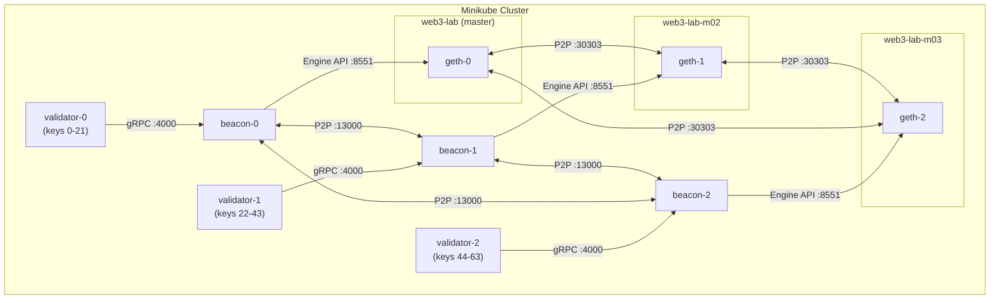
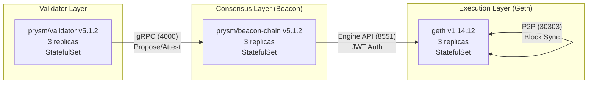
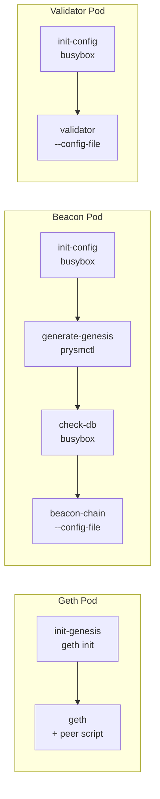
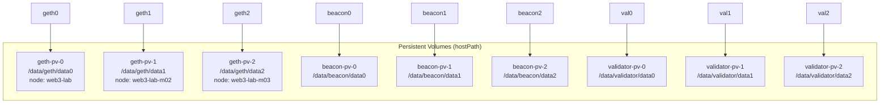

# Geth PoS Cluster — Architecture

Private Ethereum Proof-of-Stake cluster running on Minikube (3-node, Docker driver).

## Cluster Topology



## Three-Layer Architecture



| Layer           | Image                         | Replicas | Storage | Key Ports                                 |
| --------------- | ----------------------------- | -------- | ------- | ----------------------------------------- |
| **Geth (EL)**   | `ethereum/client-go:v1.14.12` | 3        | 5Gi     | RPC 8545, WS 8546, Engine 8551, P2P 30303 |
| **Beacon (CL)** | `prysm/beacon-chain:v5.1.2`   | 3        | 5Gi     | gRPC 4000, HTTP 3500, P2P 13000/12000     |
| **Validator**   | `prysm/validator:v5.1.2`      | 3        | 1Gi     | Monitoring 8081                           |

## Layer Responsibilities

### Geth (Execution Layer) — 交易執行引擎

- Execute transactions (EVM), maintain world state (balances, contracts, nonces)
- Assemble block payloads from pending transactions
- Expose JSON-RPC API (`eth_*`, `admin_*`, `debug_*`)
- P2P sync blocks and transaction pool with other Geth nodes

### Beacon (Consensus Layer) — 共識協調者

- Manage validator set (stakes, entries, exits)
- Assign block proposers each slot (4s) and attestation committees
- Drive Geth via Engine API: request new payloads, confirm finalized blocks
- Collect attestations, determine finality (≥2/3 vote threshold)
- P2P gossip: broadcast blocks, attestations, slashing evidence

### Validator — 簽名與投票機器

- Hold validator private keys (interop keys, sharded across 3 instances)
- Propose blocks when assigned by Beacon, sign and submit
- Submit attestations (votes) for assigned committee slots
- Maintain slashing protection database to prevent double-signing

## Deployment Flow

```mermaid
sequenceDiagram
    participant O as Operator
    participant K as Kubernetes
    participant Init as Init Containers
    participant Pod as Main Containers

    O->>K: make deploy-pos
    K->>Init: geth init-genesis (geth init)
    Init-->>Pod: chaindata initialized
    Pod->>Pod: geth starts + auto-peer script
    Note over Pod: --nat=extip:$POD_IP<br>Background script rewrites<br>enode with peer DNS,<br>calls admin_addPeer

    K->>Init: beacon init-config (busybox)
    K->>Init: beacon generate-genesis (prysmctl)
    K->>Init: beacon check-db (busybox)
    Note over Init: If DB exists: remove genesis.ssz<br>If no DB: add genesis-state to config
    Init-->>Pod: genesis.ssz + config.yaml ready
    Pod->>Pod: beacon-chain starts with --config-file

    K->>Init: validator init-config (busybox)
    Init-->>Pod: config.yaml with key shard + beacon endpoint
    Pod->>Pod: validator starts with --config-file

    O->>K: make setup-beacon-peers
    K->>Pod: GET /eth/v1/node/identity (each beacon)
    Pod-->>K: peer IDs returned
    K->>K: Create beacon-peers ConfigMap
    K->>Pod: rollout restart beacon StatefulSet
    Pod<-->Pod: Beacon P2P mesh established
```

## Init Container Strategy

Prysm Docker images are **distroless** (no shell). All dynamic config uses busybox init containers → `--config-file`.



### Beacon Init Containers

| Init Container     | Image             | Purpose                                                                                         |
| ------------------ | ----------------- | ----------------------------------------------------------------------------------------------- |
| `init-config`      | `busybox:1.36`    | Writes ordinal-specific YAML + P2P peer multiaddrs (from optional ConfigMap)                    |
| `generate-genesis` | `prysmctl:v5.1.2` | Generates `genesis.ssz` with 64 interop validators for Deneb fork                               |
| `check-db`         | `busybox:1.36`    | If beacon DB exists: removes genesis.ssz (skip re-init). If not: adds `genesis-state` to config |

### Validator Key Sharding

```
64 interop validators split across 3 instances:
  validator-0: keys  0-21  (22 keys)
  validator-1: keys 22-43  (22 keys)
  validator-2: keys 44-63  (20 keys)
```

## Beacon P2P Peering

Two-phase approach because peer IDs are generated at first boot:

```mermaid
sequenceDiagram
    participant O as Operator
    participant B0 as beacon-0
    participant B1 as beacon-1
    participant B2 as beacon-2
    participant CM as ConfigMap

    Note over B0,B2: Phase 1: First boot (no peers)
    B0->>B0: Generate P2P key, save to PV
    B1->>B1: Generate P2P key, save to PV
    B2->>B2: Generate P2P key, save to PV

    Note over O,CM: Phase 2: make setup-beacon-peers
    O->>B0: GET /eth/v1/node/identity
    O->>B1: GET /eth/v1/node/identity
    O->>B2: GET /eth/v1/node/identity
    O->>CM: Create beacon-peers ConfigMap
    O->>B0: rollout restart
    B0->>CM: init-config reads peers.txt
    B0<-->B1: P2P connected
    B0<-->B2: P2P connected
    B1<-->B2: P2P connected
```

## Health Probes

| Component     | Liveness                       | Readiness                                 |
| ------------- | ------------------------------ | ----------------------------------------- |
| **Geth**      | TCP `:8545` (RPC)              | TCP `:8545` (RPC)                         |
| **Beacon**    | TCP `:4000` (gRPC)             | HTTP GET `/eth/v1/node/health` on `:3500` |
| **Validator** | HTTP GET `/healthz` on `:8081` | HTTP GET `/healthz` on `:8081`            |

## Chain Configuration

| Parameter               | Value                              |
| ----------------------- | ---------------------------------- |
| **Chain ID**            | 72390                              |
| **Network ID**          | 72390                              |
| **Consensus**           | PoS from genesis (TTD=0)           |
| **EL State Scheme**     | `path`                             |
| **EL Sync Mode**        | `full`                             |
| **CL Fork**             | Deneb (all prior forks at epoch 0) |
| **Electra**             | Disabled (epoch = max uint64)      |
| **Slot Time**           | 4 seconds                         |
| **Validators**          | 64 (interop keys)                  |
| **Pre-funded Accounts** | 10 accounts × 1000 ETH             |

## Persistent Storage



All PVs use `hostPath` with `nodeAffinity` to pin storage to specific Minikube nodes.

## Geth Auto-Peering

Geth nodes discover each other via a background script in the main container. `--nat=extip:$POD_IP` ensures enode URLs advertise the real pod IP (not 127.0.0.1):

```mermaid
sequenceDiagram
    participant G0 as geth-0
    participant G1 as geth-1
    participant G2 as geth-2

    Note over G0,G2: All nodes start geth with --nat=extip:$POD_IP

    G0->>G1: GET admin_nodeInfo via RPC :8545
    G1-->>G0: enode://...@127.0.0.1:30303
    G0->>G0: Rewrite to enode://...@geth-1.geth-headless:30303
    G0->>G0: admin_addPeer(enode)

    Note over G0,G2: Repeat for all peer pairs
    G0<-->G1: P2P sync (stable, 2 peers each)
    G1<-->G2: P2P sync
```

## Makefile Targets

| Target                         | Description                                               |
| ------------------------------ | --------------------------------------------------------- |
| `make deploy-pos`              | Deploy full PoS cluster (PVs + Geth + Beacon + Validator) |
| `make delete-pos`              | Delete PoS cluster                                        |
| `make cleanup-pos-data`        | Wipe all PoS data from Minikube nodes                     |
| `make cleanup-pos-pvc`         | Delete all PoS PVCs                                       |
| `make cleanup-pos-pv`          | Delete all PoS PVs                                        |
| `make cleanup-geth-data`       | Wipe only Geth chain data                                 |
| `make setup-beacon-peers`      | Configure beacon P2P peering (requires running beacons)   |
| `make check-host-paths`        | Check PV host path directories on all Minikube nodes      |
| `make check-pos-status`        | Deep health check (geth peers, beacon sync, validators)   |
| `make verify-nodes`            | Check all pod statuses                                    |
| `make port-forward-geth-rpc`   | Forward Geth RPC to localhost:8545                        |
| `make port-forward-geth-ws`    | Forward Geth WS to localhost:8546                         |
| `make port-forward-beacon-api` | Forward Beacon HTTP API to localhost:3500                 |

### Full Lifecycle

```
Clean:  make delete-pos → cleanup-pos-pvc → cleanup-pos-pv → cleanup-pos-data
Deploy: make apply-pv → deploy-pos
Peer:   make setup-beacon-peers
Verify: make check-pos-status
```

## PoS vs PoA — Node Role Comparison

### PoA (Proof of Authority) — Single-Layer

PoA only needs **one program (Geth)** — consensus (Clique engine) is built-in:

| Role             | Software                  | Responsibility                                 |
| ---------------- | ------------------------- | ---------------------------------------------- |
| **Signer Node**  | Geth (`--mine --unlock`)  | Authorized account, takes turns signing blocks |
| **Full Node**    | Geth                      | Sync blocks, verify, serve RPC                 |
| **Archive Node** | Geth (`--gcmode=archive`) | Full + retain all historical state             |

### PoS (Proof of Stake) — Three-Layer

PoS requires **three separate programs**, each with a distinct responsibility:

| Role            | Software             | Responsibility                         | PoA Equivalent             |
| --------------- | -------------------- | -------------------------------------- | -------------------------- |
| **Geth (EL)**   | `geth`               | Execute transactions, maintain state   | ≈ Full Node (no consensus) |
| **Beacon (CL)** | `prysm/beacon-chain` | Coordinate consensus, assign proposers | ❌ No PoA equivalent       |
| **Validator**   | `prysm/validator`    | Sign blocks, submit attestations       | ≈ Signer                   |

### Key Differences

| Aspect               | PoA                             | PoS                                   |
| -------------------- | ------------------------------- | ------------------------------------- |
| **Consensus where**  | Built into Geth (Clique engine) | Separate Beacon program               |
| **Block production** | Signer accounts take turns      | Beacon randomly assigns proposer      |
| **Min. programs**    | 1 (Geth)                        | 3 (Geth + Beacon + Validator)         |
| **Finality**         | None (probabilistic)            | Yes (≥2/3 validator vote → finalized) |
| **Key type**         | EOA private key for signing     | BLS private key for attestation       |

> **TL;DR**: PoA = one Geth does everything. PoS = Geth executes, Beacon coordinates, Validator signs.

## File Structure

```
deployments/kubernetes/minikube/geth-pos-cluster/
├── genesis-configmap.yaml   # Geth genesis.json (chain ID 72390, 10 funded accounts)
├── jwt-secret.yaml          # Shared JWT for Engine API auth
├── prysm-config.yaml        # Beacon chain config (forks, slots, deposit contract)
├── services.yaml            # Geth headless + ClusterIP services
├── geth.yaml                # Geth StatefulSet (3 replicas, auto-peer, --nat=extip)
├── beacon-services.yaml     # Beacon headless + ClusterIP services
├── beacon.yaml              # Beacon StatefulSet (3 replicas, prysmctl genesis, P2P peering)
└── validator.yaml           # Validator StatefulSet (3 replicas, key sharding, monitoring)
```
