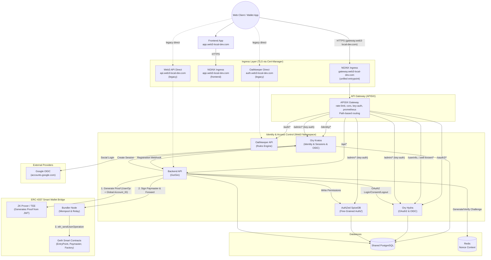

# Identity & Authorization Architecture

The Web3-Lab platform relies on a decoupled, microservice-oriented identity and authorization stack based primarily on the Ory ecosystem (Kratos, Hydra, Oathkeeper) combined with AuthZed SpiceDB.

## High-Level Architecture (Top-Bottom)

> [!NOTE]
> The dashed lines represent **legacy direct ingress** paths (`*.web3-local-dev.com`) that are kept for backward compatibility. The primary recommended path is through the APISIX gateway at `gateway.web3-local-dev.com`.

## Component Responsibilities

| Component           | Technology         | Primary Responsibility                                                                                                                                                                                                                                         |
| :------------------ | :----------------- | :------------------------------------------------------------------------------------------------------------------------------------------------------------------------------------------------------------------------------------------------------------- |
| **API Gateway**     | Apache APISIX      | Unified API gateway at `gateway.web3-local-dev.com`. Routes by path prefix, applies rate limiting (`limit-req`), admin key authentication (`key-auth`), CORS, and Prometheus metrics. Also routes `/userinfo` and `/.well-known/*` to Hydra for OIDC discovery. |
| **Identity**        | Ory Kratos         | Manages user identities, secure sessions, and registration flows. Supports Google OIDC social login via `SELFSERVICE_METHODS_OIDC_CONFIG_PROVIDERS` env var. The backend API orchestrates wallet signatures to Kratos identity sessions.                        |
| **OAuth2 Provider** | Ory Hydra          | An OAuth 2.0 and OpenID Connect provider. Issues access/refresh tokens, handles login/consent/logout challenges (delegated to Backend API), and exposes `/userinfo` at root path. `URLS_SELF_ISSUER` must NOT include `/oauth2` suffix.                          |
| **Backend API**     | Go/Gin             | Handles OAuth2 login/consent/logout webhook callbacks from Hydra, auto-accepts consent for first-party clients, manages app client configs (cached in Redis), and coordinates wallet auth challenge/verify flows.                                                |
| **Authorization**   | AuthZed SpiceDB    | Implements scalable Relationship-Based Access Control (ReBAC) based on Google Zanzibar. Calculates whether "Subject X can perform Action Y on Resource Z".                                                                                                     |
| **Edge Proxy**      | Ory Oathkeeper     | Sits at the edge of internal APIs, authenticating requests by resolving cookies (Kratos) or tokens (Hydra), checking permissions (SpiceDB), and proxying valid traffic forward.                                                                                |
| **Frontend**        | React/Vite         | Single-page app at `app.web3-local-dev.com` with login (email, Google OIDC, SIWE), OAuth2 callback, profile page (fetches `/userinfo`), and dashboard.                                                                                                        |
| **Datastores**      | PostgreSQL & Redis | Shared Postgres isolates schemas for Hydra, Kratos, SpiceDB and the application. Redis caches app client configs and manages ephemeral data like Wallet Authentication nonces.                                                                                 |
| **ZK Prover**       | TEE / Microservice | (Web2.5 Bridge) Generates Groth16/Plonk proofs affirming that a given UserOperation intent was cryptographically authorized by a valid authentication session mapped to a Global Account ID. |
| **Bundler**         | Go-Ethereum Node   | (Web2.5 Bridge) Collects EIP-4337 UserOperations, bundles them into standard Ethereum transactions, pays native gas fees (refunded by Paymaster), and submits them to the EntryPoint contract. |
