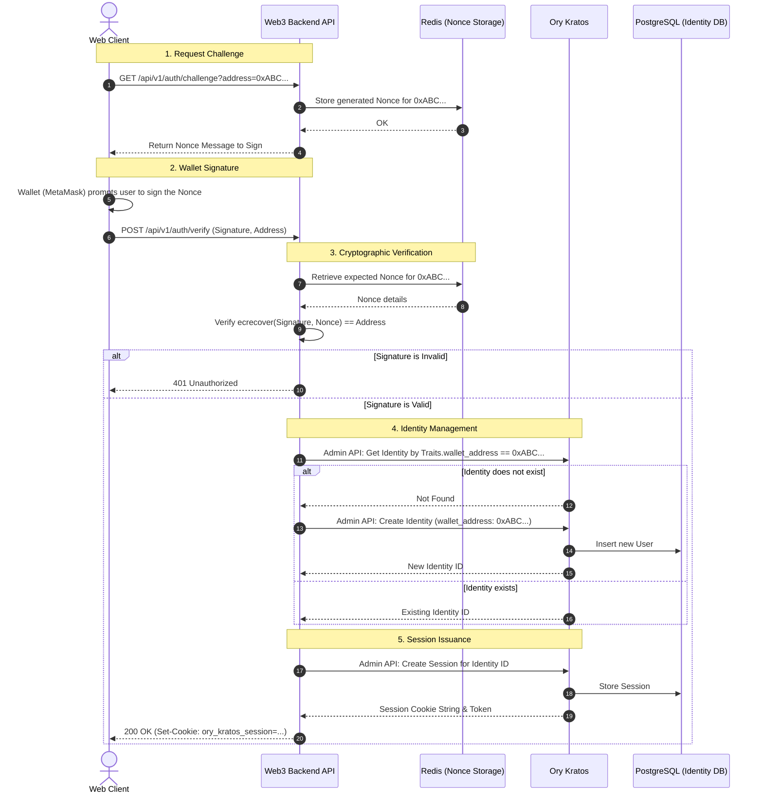
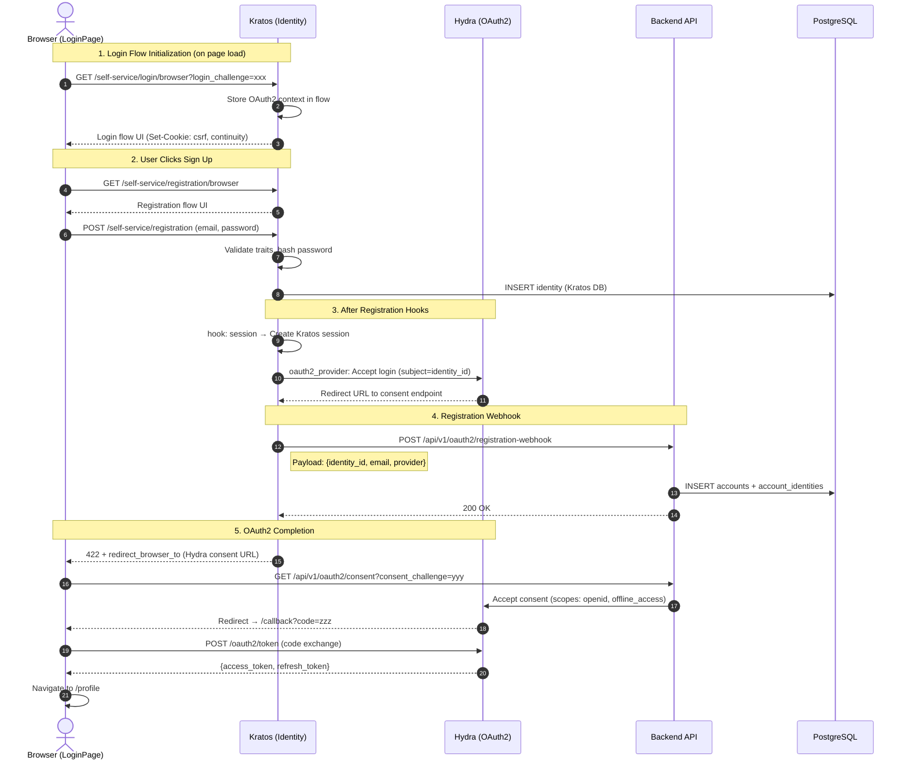
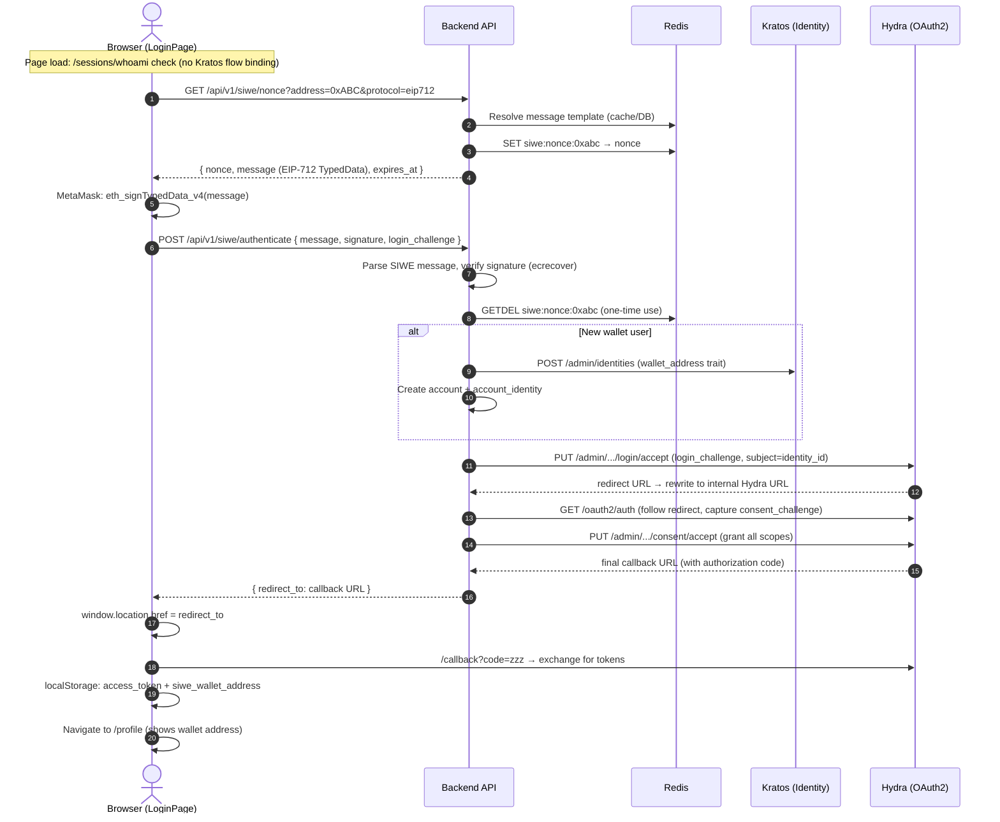
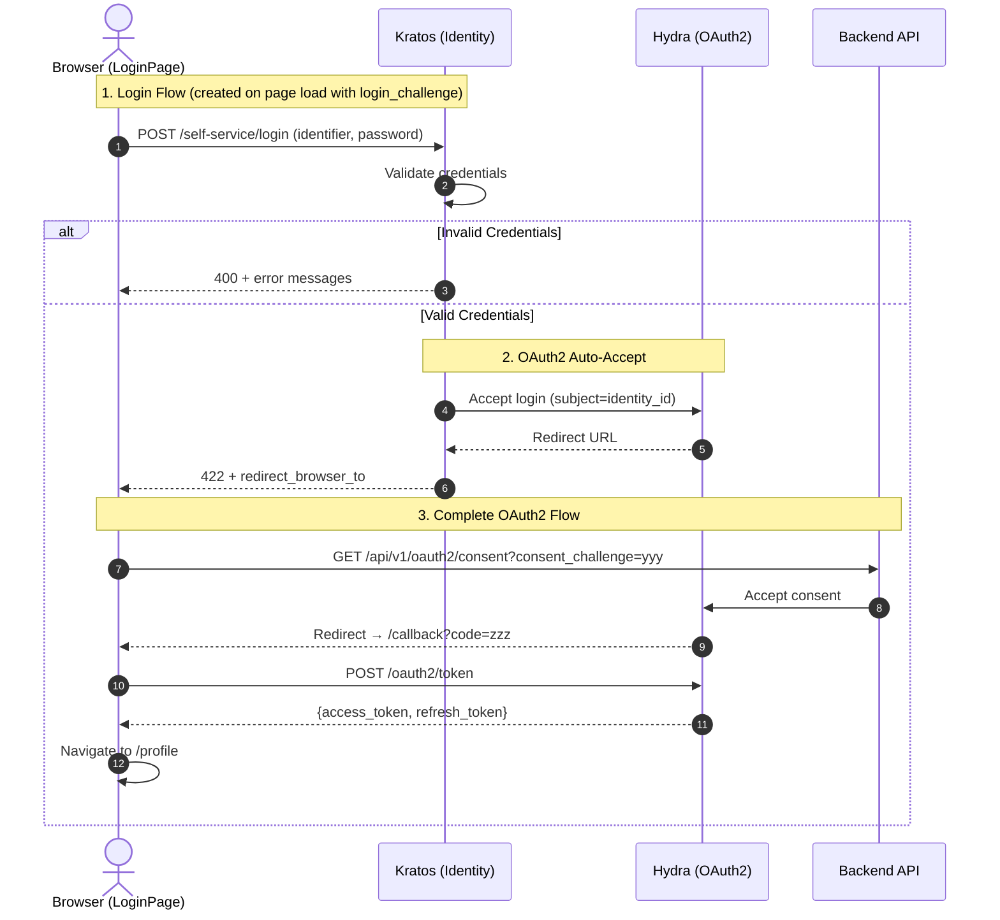
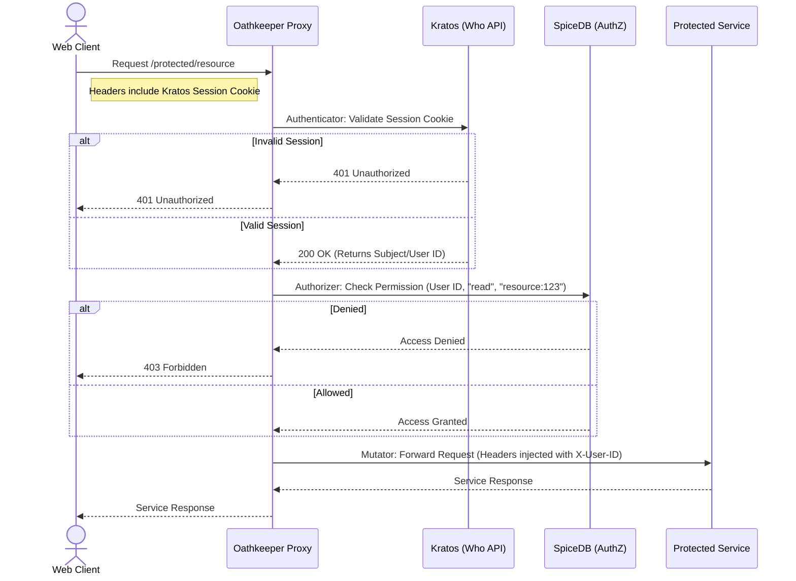
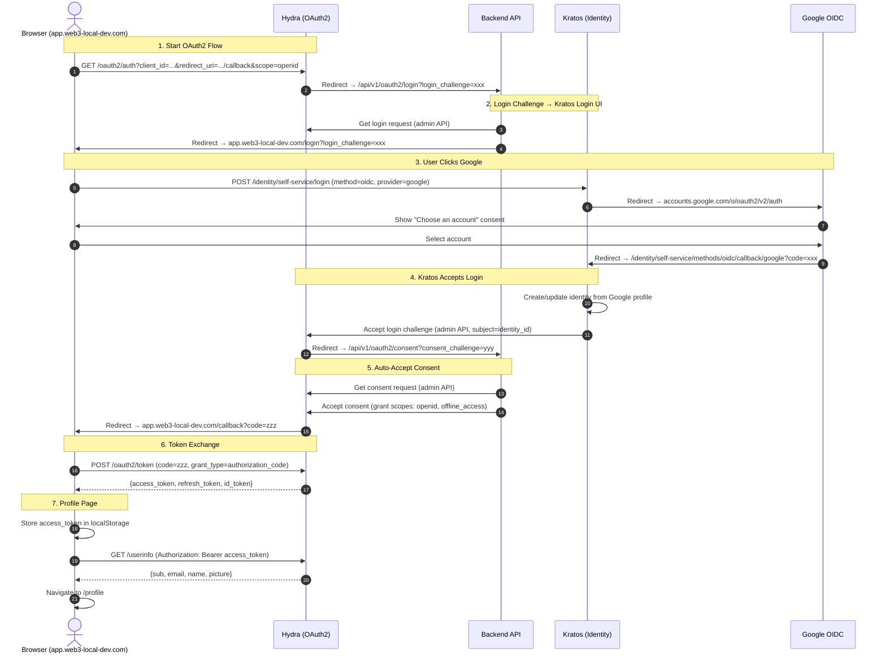
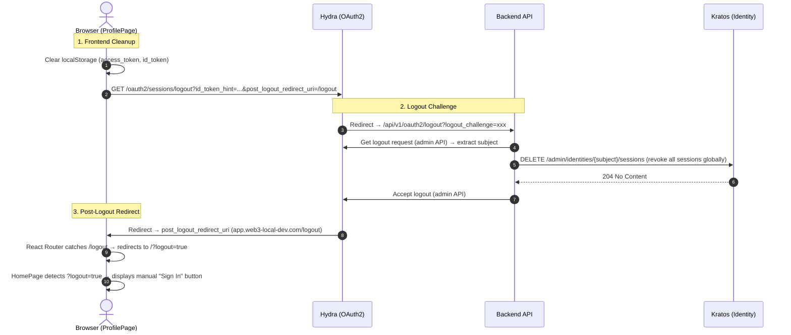
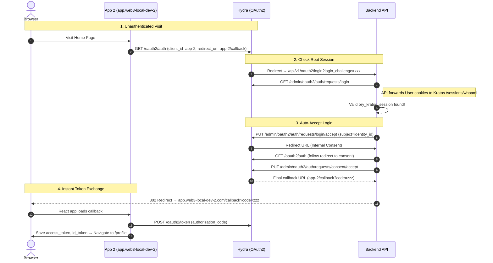

# Web3 Wallet Authentication Flow

Because Web3 applications authenticate users via cryptographic wallet signatures instead of traditional passwords, the backend API must coordinate between the Wallet, Redis (for nonce storage), and Ory Kratos (for session issuance).

## Authentication Sequence Diagram

The following sequence details how a user connects their wallet, signs a specialized challenge message, and obtains a secure HTTP-only session cookie from Ory Kratos.



## Email Registration + OAuth2 Auto-Login Flow

When a user signs up via email/password on the LoginPage (which was reached via an OAuth2 login challenge), Kratos creates the identity, establishes a session, fires the registration webhook, and then auto-accepts the Hydra login — redirecting the user directly to the profile page.



> [!IMPORTANT]
> **Critical Kratos Registration Hooks Order:**
> ```yaml
> registration.after.password.hooks:
>   - hook: session       # MUST be first — creates ory_kratos_session
>   - hook: web_hook      # Fires registration webhook to backend API
> ```
> Without the `session` hook, Kratos does NOT create a session after registration, the `oauth2_provider` integration cannot auto-accept the Hydra login, and the response is 200 (not 422) with no redirect URL.

> [!NOTE]
> The registration webhook uses **provider-specific Jsonnet templates**: `registration-webhook-email.jsonnet` for password method and `registration-webhook-oidc.jsonnet` for OIDC. This avoids accessing `ctx.identity.credentials` which is not available in the webhook context.

## SIWE (Sign-In with Ethereum) + OAuth2 Flow

When a user authenticates via MetaMask wallet signature, the backend API handles the entire Hydra OAuth2 flow server-side (no Kratos session needed). This is fundamentally different from Email/Google login where Kratos manages the session and auto-accepts the Hydra login.



> [!IMPORTANT]
> **Key Differences from Email/Google Login:**
> - SIWE bypasses Kratos session creation — `AcceptLoginRequest` uses identity_id directly as the Hydra subject.
> - The `login_challenge` must NOT be bound to a Kratos flow before SIWE uses it (page load uses `/sessions/whoami` instead of `/login/browser?login_challenge=xxx`).
> - The redirect URL from `AcceptLoginRequest` uses the external gateway hostname, which is rewritten to the internal Hydra service URL via `rewriteToInternalURL()`.

## Email Sign-In + OAuth2 Flow

When a user signs in with email/password on the LoginPage, Kratos validates credentials and auto-accepts the Hydra login via `oauth2_provider`. The response is HTTP 422 with `redirect_browser_to`.



> [!NOTE]
> The frontend checks for `redirect_browser_to` in the response body **BEFORE** checking `submitRes.ok`. Kratos returns HTTP 422 (not 200) for successful auth when `oauth2_provider` is configured, so the `ok` check would fail if checked first.


## API Access Control Flow (Oathkeeper + SpiceDB)

Once the user has a Kratos Session Cookie, they can call protected APIs through Oathkeeper.



## Google OIDC + OAuth2 Login Flow

When a user clicks "Sign in via OAuth2" → "Google", the following multi-service redirect chain authenticates them and issues an OAuth2 access token.



> [!IMPORTANT]
> **Key Configuration Gotchas:**
> - Hydra `URLS_SELF_ISSUER` must be `https://gateway.web3-local-dev.com` (without `/oauth2` suffix) — otherwise Hydra generates doubled paths like `/oauth2/oauth2/auth`
> - Kratos OIDC credentials must use `SELFSERVICE_METHODS_OIDC_CONFIG_PROVIDERS` env var (full JSON array) — the `env://` syntax does NOT work inside nested OIDC provider configs
> - Hydra serves `/userinfo` at root path, NOT under `/oauth2/` — requires a separate APISIX route
> - APISIX CORS `allow_origins` must include `https://app.web3-local-dev.com` for frontend cross-origin requests
> - The backend consent handler auto-accepts all consent for first-party clients (no consent screen)
> - Kratos registration hooks MUST include `- hook: session` before `- hook: web_hook` — without it, no session is created and `oauth2_provider` cannot auto-accept the Hydra login
> - Kratos returns HTTP 422 (not 200) for successful auth when `oauth2_provider` is configured — the frontend must check `redirect_browser_to` before `submitRes.ok`
> - The backend `HandleLogin` checks for Kratos session via `/sessions/whoami` (forwarding cookies) when Hydra `skip=false` — this enables auto-login for users who already have a Kratos session

The flow described above routes through the **APISIX gateway** at `gateway.web3-local-dev.com`, which performs consumer-based API key authentication before proxying to the backend endpoints.

## SIWE (EIP-4361) Authentication Flow

> [!NOTE]
> The SIWE flow replaces the legacy `/api/v1/auth/challenge` and `/api/v1/auth/verify` endpoints with a standardized EIP-4361 message format. See the full spec at [`openspec/specs/siwe/spec.md`](../../openspec/specs/siwe/spec.md).

### Endpoints

| Method | Path                        | Purpose                                    |
| :----- | :-------------------------- | :----------------------------------------- |
| GET    | `/api/v1/siwe/nonce`        | Generate nonce + EIP-4361 formatted message |
| POST   | `/api/v1/siwe/verify`       | Verify → Kratos session (standalone)       |
| POST   | `/api/v1/siwe/authenticate` | Verify → Hydra OAuth2 redirect             |

### Key Differences from Legacy Flow

| Feature            | Legacy (`/auth/challenge`)  | SIWE (`/siwe/nonce`)                       |
| :----------------- | :-------------------------- | :----------------------------------------- |
| Message format     | Custom plain text           | EIP-4361 standard (human-readable in wallet) |
| Protocol support   | EIP-191 only                | EIP-191 (SIWE) + EIP-712                   |
| Message config     | Hardcoded in config.go      | PostgreSQL `message_templates` + Redis cache |
| OAuth2 integration | Separate `/oauth2/login`    | Built into `/siwe/authenticate`            |
| Client-specific    | No                          | Yes (via `app_clients.message_template_id`) |

### Dual-Protocol Support

- **SIWE (EIP-4361)**: Uses `personal_sign` (EIP-191). The wallet displays a human-readable message conforming to the SIWE ABNF format.
- **EIP-712**: Uses `eth_signTypedData_v4`. The wallet displays structured typed data with a domain separator.

The `protocol` query parameter on `/api/v1/siwe/nonce` determines which format is generated. Sign-in message templates are stored in the `message_templates` table and cached in Redis with a 1-hour TTL.

## OAuth2 Logout Flow

When the user clicks "Sign Out" on the Profile page, the frontend clears localStorage and redirects to Hydra's logout endpoint. The backend receives the logout challenge, revokes all Kratos sessions (to prevent auto-re-login), and accepts the Hydra logout.



> [!IMPORTANT]
> **Logout Must Revoke Kratos Sessions:**
> Hydra's logout only kills the Hydra/OAuth2 session. The `ory_kratos_session` cookie remains valid in the browser. Without revoking Kratos sessions in `HandleLogout`, the next OAuth2 flow (triggered by HomePage auto-redirect) would find the valid Kratos session via `HandleLogin` → auto-accept → user is immediately re-authenticated in a loop.

> [!NOTE]
> The `?logout=true` query parameter prevents the HomePage from auto-triggering the OAuth2 flow. Without it, the HomePage's `useEffect` immediately starts a new OAuth2 flow, which — if Kratos sessions were not revoked — would re-authenticate the user instantly.

## Cross-Domain & Cross-TLD Single Sign-On (SSO) Flow

Because Kratos securely manages the root identity session via HTTP-only cookies tied to the central gateway domain (`.web3-local-dev.com`), **any** frontend application—even those on entirely different top-level domains (e.g., `.net`)—can achieve instantaneous SSO without requiring the user to sign a new wallet message or enter a password.

The cookie is strictly bound to the central authentication provider. When the user initiates a login from `app.web3-local-dev.net` (App-3), their browser is redirected to the central gateway, which seamlessly attaches the existing session cookie.



> [!TIP]
> **Public Client Considerations**
> Since `App-2` is a Single Page Application (SPA), it must be registered as a Public Client (`token_endpoint_auth_method: none`) in Hydra. The frontend must **not** send a `client_secret` during the token code exchange.

> [!IMPORTANT]
> **Database Registry Requirement for Cross-Domain Clients:**
> Registering a new frontend application purely in Hydra (via `curl -X POST /admin/clients`) is **not enough**. 
> The central Web3 Account API intercepts all login challenges from Hydra to determine where to redirect the user for the UI. It dynamically looks up the frontend URLs using the `oauth2_client_id`. 
> Therefore, you **must** also insert the application's configuration metadata into the core PostgreSQL `app_clients` table (which is then cached in Redis), otherwise the API will fallback to vomiting raw JSON payloads instead of redirecting the user to a polished login UI.

