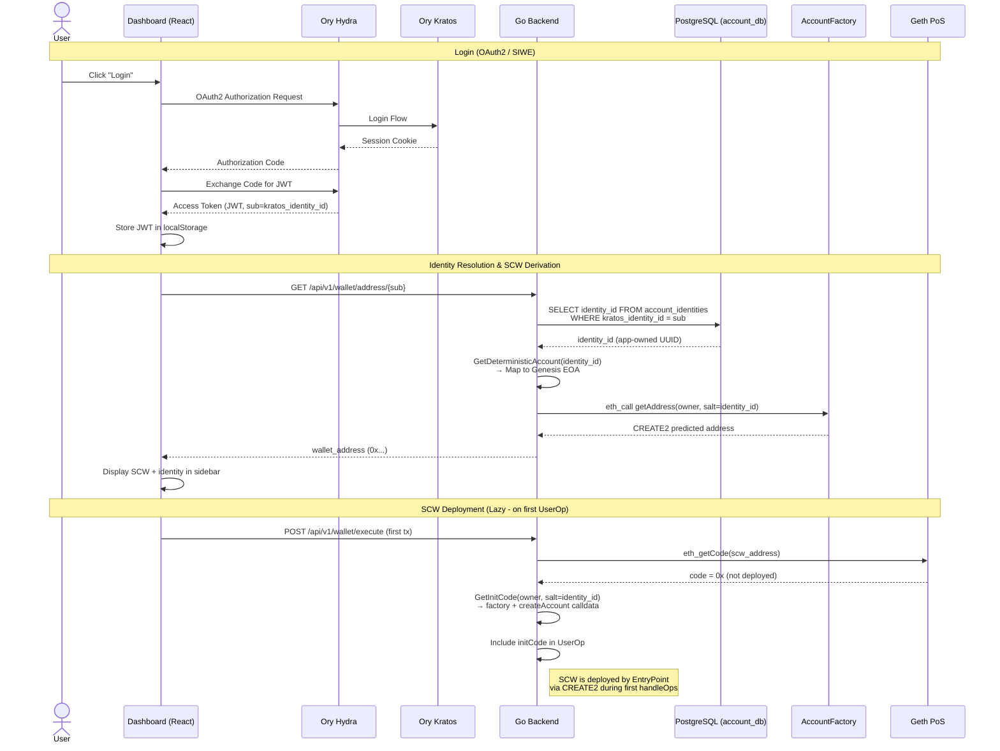
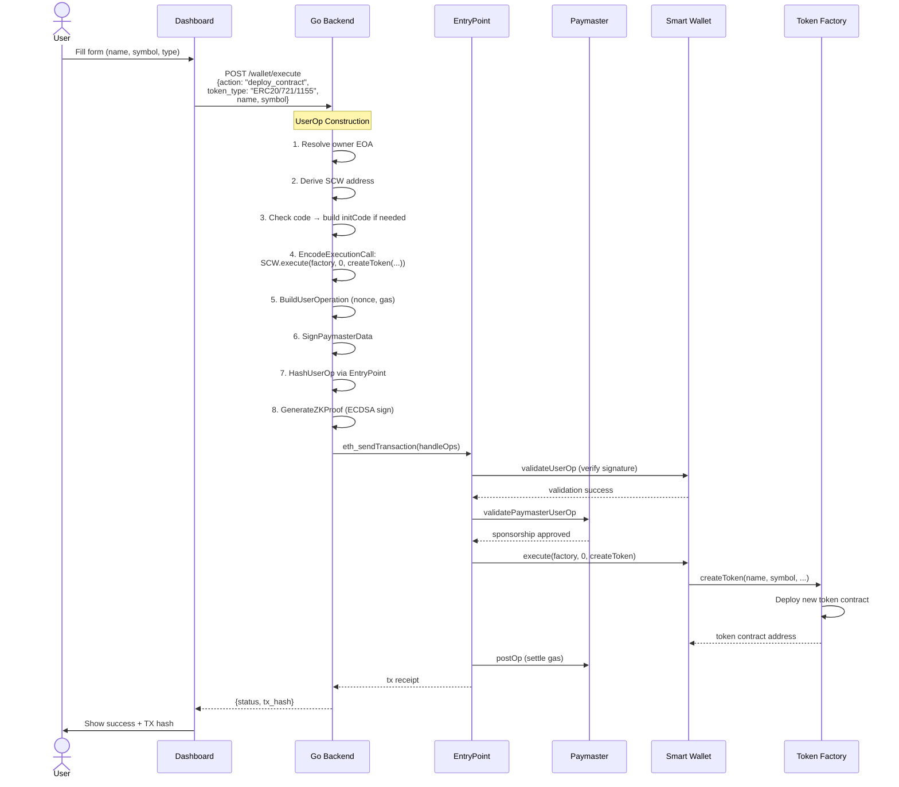
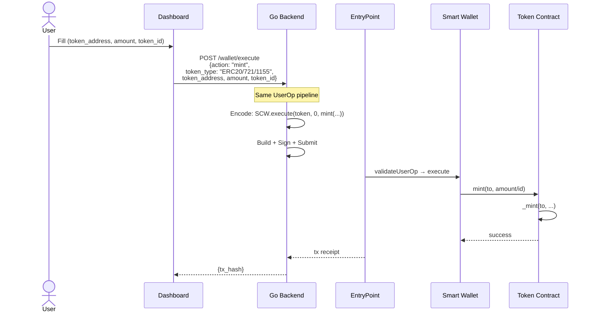
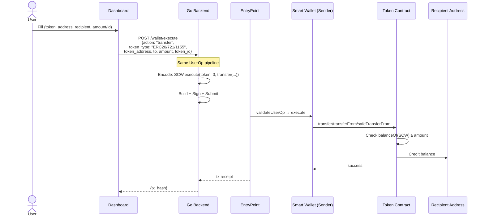
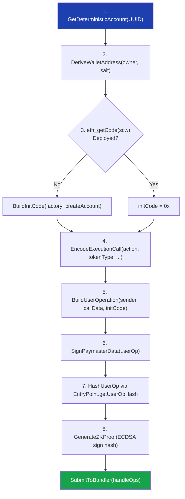
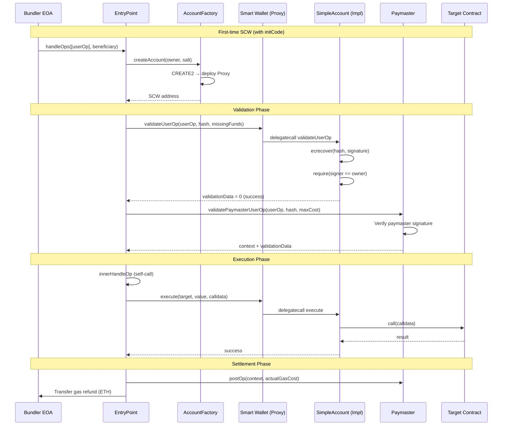
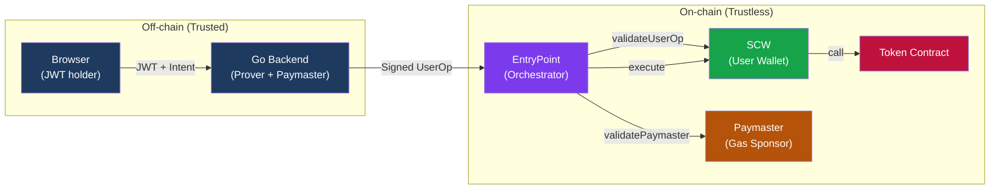

# Web2.5 Smart Wallet Bridge — Sequence & TB Flow

## Table of Contents

- [1. Authentication & SCW Creation](#1-authentication--scw-creation)
- [2. Deploy Contract (ERC-20 / ERC-721 / ERC-1155)](#2-deploy-contract)
- [3. Mint Asset (ERC-20 / ERC-721 / ERC-1155)](#3-mint-asset)
- [4. Transfer Asset (ERC-20 / ERC-721 / ERC-1155)](#4-transfer-asset)
- [5. Unified UserOperation Pipeline](#5-unified-useroperation-pipeline)
- [6. On-chain Execution Flow](#6-on-chain-execution-flow)
- [7. Security Boundaries](#7-security-boundaries)

---

## 1. Authentication & SCW Creation

### Sequence Diagram

### TB Flow — Login & SCW Creation

| Step | Actor   | Action                  | Input                       | Output                           | Location        |
| :--- | :------ | :---------------------- | :-------------------------- | :------------------------------- | :-------------- |
| 1    | User    | Click Login             | —                           | Redirect                         | Browser         |
| 2    | Hydra   | OAuth2 flow             | Auth request                | Login UI                         | Off-chain       |
| 3    | Kratos  | Authenticate            | Email + Password            | Session                          | Off-chain       |
| 4    | Hydra   | Issue JWT               | Session                     | `access_token` (sub=kratos_uuid) | Off-chain       |
| 5    | Browser | Store token             | JWT                         | localStorage                     | Browser         |
| 6    | Browser | Fetch SCW address       | JWT `sub`                   | —                                | Browser         |
| 7    | API     | **Resolve identity**    | `kratos_identity_id`        | `account_identities.identity_id` | Off-chain (DB)  |
| 8    | API     | Map identity → EOA      | `identity_id`               | Genesis EOA address              | Off-chain       |
| 9    | Factory | Predict CREATE2 address | `owner`, `salt=identity_id` | SCW address                      | On-chain (view) |
| 10   | Browser | Display SCW + identity  | address, identity_id        | Sidebar widget                   | Browser         |

> **Note**: SCW is **not deployed** at login time. It is lazily deployed during the first `UserOperation` via `initCode`. The `getAddress` call is a view function that predicts the CREATE2 address without deploying.
>
> **Identity Resolution**: The JWT `sub` (Kratos UUID) is resolved to the app-owned `identity_id` via `account_identities.kratos_identity_id` lookup. This `identity_id` is used as the CREATE2 salt, making the SCW address auth-provider-independent.

---

## 2. Deploy Contract

### Sequence Diagram

### TB Flow — Deploy Contract

| Step | Component  | Action            | Target             | Calldata Signature                   |
| :--- | :--------- | :---------------- | :----------------- | :----------------------------------- |
| 1    | Browser    | Submit intent     | API                | `{action: "deploy_contract"}`        |
| 2    | API        | Resolve EOA       | SmartWalletService | `GetDeterministicAccount(uuid)`      |
| 3    | API        | Derive address    | Factory (view)     | `getAddress(owner, salt)`            |
| 4    | API        | Encode inner call | —                  | See below per token type             |
| 5    | API        | Wrap in execute   | —                  | `execute(factory, 0, innerCallData)` |
| 6    | API        | Build UserOp      | EntryPoint (view)  | `getNonce(sender, 0)`                |
| 7    | API        | Sign paymaster    | Local              | ECDSA sign                           |
| 8    | API        | Hash UserOp       | EntryPoint (view)  | `getUserOpHash(op)`                  |
| 9    | API        | Sign UserOp       | Local (ZK mock)    | ECDSA sign                           |
| 10   | EntryPoint | handleOps         | On-chain           | Validate + Execute                   |
| 11   | SCW        | execute → Factory | On-chain           | `createToken(...)`                   |

#### Deploy Inner Calldata by Token Type

| Token        | Factory Target       | Method Signature                           | Parameters                            |
| :----------- | :------------------- | :----------------------------------------- | :------------------------------------ |
| **ERC-20**   | `ERC20FactoryAddr`   | `createToken(string,string,uint8,uint256)` | name, symbol, decimals, initialSupply |
| **ERC-721**  | `ERC721FactoryAddr`  | `createNFT(string,string,string)`          | name, symbol, baseURI                 |
| **ERC-1155** | `ERC1155FactoryAddr` | `createMultiToken(string,string,string)`   | name, symbol, uri                     |

---

## 3. Mint Asset

### Sequence Diagram

### TB Flow — Mint Asset

| Token        | Target         | Method Signature                      | Parameters                | Semantics                |
| :----------- | :------------- | :------------------------------------ | :------------------------ | :----------------------- |
| **ERC-20**   | Token contract | `mint(address,uint256)`               | to, amount×10¹⁸           | SCW must be owner/minter |
| **ERC-721**  | Token contract | `mint(address)`                       | to                        | Auto-increment tokenId   |
| **ERC-1155** | Token contract | `mint(address,uint256,uint256,bytes)` | to, tokenId, amount, data | Multi-token mint         |

> **Important**: `mint` is NOT `transfer`. Minting creates **new** tokens. The `from` address in the Transfer event is `0x0000...0000`. The calling SCW must have the `MINTER_ROLE` or be the contract owner.
>
> **Zero-Balance Indexing Caveat**: Newly deployed token contracts strictly contain a user balance of `0`. The API portfolio endpoint (which structurally omits 0-balance dependencies) will not index this contract until the initial mint occurs. The active frontend mitigates this by enforcing a `+(Enter Custom Contract Address)` dropdown fallback mechanism for all zero-to-one origin mints.

---

## 4. Transfer Asset

### Sequence Diagram

### TB Flow — Transfer Asset

| Token        | Target         | Method Signature                                          | Parameters                           | Precondition                     |
| :----------- | :------------- | :-------------------------------------------------------- | :----------------------------------- | :------------------------------- |
| **ERC-20**   | Token contract | `transfer(address,uint256)`                               | to, amount×10¹⁸                      | SCW balance ≥ amount             |
| **ERC-721**  | Token contract | `transferFrom(address,address,uint256)`                   | from(SCW), to, tokenId               | SCW owns tokenId                 |
| **ERC-1155** | Token contract | `safeTransferFrom(address,address,uint256,uint256,bytes)` | from(SCW), to, tokenId, amount, data | SCW balance ≥ amount for tokenId |

> **Failure Case**: If the SCW doesn't have sufficient balance, the on-chain call reverts with `ERC20InsufficientBalance` / `ERC721InsufficientApproval` / `ERC1155InsufficientBalance`. The top-level TX still succeeds (EntryPoint catches the revert), but the UserOperation is marked as failed via `UserOperationRevertReason` event.

---

## 5. Unified UserOperation Pipeline

All actions (deploy, mint, transfer) go through the **same** 8-step pipeline in the Go Backend:

### Pipeline Detail Table

| #   | Step                 | Service                 | Method                                              | Description                                 |
| :-- | :------------------- | :---------------------- | :-------------------------------------------------- | :------------------------------------------ |
| 0   | **Resolve Identity** | DB (account_identities) | `SELECT identity_id WHERE kratos_identity_id = sub` | JWT sub → app-owned identity_id             |
| 1   | Map Identity         | SmartWalletService      | `GetDeterministicAccount`                           | identity_id mod N → Genesis EOA             |
| 2   | Derive Address       | SmartWalletService      | `DeriveWalletAddress`                               | Factory.getAddress(owner, salt=identity_id) |
| 3   | Check Deploy         | BundlerService          | `GetClient().CodeAt`                                | If code=0x → include initCode               |
| 4   | Encode Call          | BundlerService          | `EncodeExecutionCall`                               | Action-specific ABI encoding                |
| 5   | Build UserOp         | BundlerService          | `BuildUserOperation`                                | Nonce, gas limits, structure                |
| 6   | Paymaster Sign       | BundlerService          | `SignPaymasterData`                                 | Add paymaster sponsorship                   |
| 7   | Hash                 | BundlerService          | `HashUserOp`                                        | EntryPoint.getUserOpHash (EIP-712)          |
| 8   | Prove/Sign           | SmartWalletService      | `GenerateZKProof`                                   | ECDSA signature (ZK mock)                   |
| 9   | Submit               | BundlerService          | `SubmitToBundler`                                   | handleOps → on-chain TX                     |

---

## 6. On-chain Execution Flow

---

## 7. Security Boundaries

### Permission Model

| Attack Vector                                   | Protection Layer                 | Result                        |
| :---------------------------------------------- | :------------------------------- | :---------------------------- |
| A's SCW tries to spend B's SCW tokens           | ERC-20 `balanceOf` check         | ❌ `ERC20InsufficientBalance` |
| Forge another user's UserOp signature           | SCW `ecrecover` verification     | ❌ Invalid signer             |
| Call SCW.execute() directly (bypass EntryPoint) | `onlyEntryPointOrOwner` modifier | ❌ Unauthorized               |
| Submit UserOp without gas payment               | Paymaster signature validation   | ❌ Invalid paymaster sig      |
| Replay a previously used UserOp                 | EntryPoint nonce tracking        | ❌ Nonce already used         |
