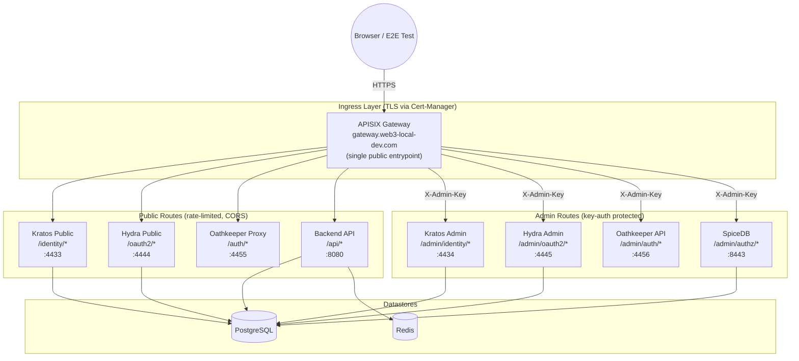

# OpenSpec: APISIX Auth Gateway

## Status

In Progress 🚧

## Context

The Identity & Authorization Stack (Ory Kratos, Hydra, Oathkeeper, AuthZed SpiceDB) currently exposes all service APIs — including admin endpoints — directly via per-service NGINX Ingress hostnames (`kratos.web3-local-dev.com`, `hydra-admin.web3-local-dev.com`, etc.). This creates several concerns:

- **Admin APIs are unauthenticated** — anyone who can reach the ingress can call admin endpoints
- **No rate limiting** — login and registration endpoints are vulnerable to brute force and credential stuffing
- **No unified observability** — each service's traffic is invisible at the gateway layer
- **CORS managed per-service** — configuration is scattered instead of centralized

This spec introduces **Apache APISIX** as a unified API gateway in front of the auth stack, consolidating all external traffic through a single ingress host (`gateway.web3-local-dev.com`) with path-based routing, TLS termination, rate limiting, admin key-auth protection, and Prometheus metrics.

## Documentation References

- [Architecture & Sequence Flows](../../../documents/apisix/architecture.md)

## Architecture



### Route & Plugin Matrix

| Path Prefix | Upstream Service | Port | Plugins | Access |
|---|---|---|---|---|
| `/identity/*` | `kratos-public` | 4433 | `limit-req`, `cors`, `prometheus`, `proxy-rewrite` | Public |
| `/oauth2/*` | `hydra-public` | 4444 | `limit-req`, `cors`, `prometheus`, `proxy-rewrite` | Public |
| `/auth/*` | `oathkeeper-proxy` | 4455 | `limit-req`, `cors`, `prometheus`, `proxy-rewrite` | Public |
| `/api/*` | `web3-api` | 8080 | `cors`, `prometheus`, `proxy-rewrite` | Public |
| `/admin/identity/*` | `kratos-admin` | 4434 | `key-auth`, `prometheus`, `proxy-rewrite` | Admin |
| `/admin/oauth2/*` | `hydra-admin` | 4445 | `key-auth`, `prometheus`, `proxy-rewrite` | Admin |
| `/admin/auth/*` | `oathkeeper-api` | 4456 | `key-auth`, `prometheus`, `proxy-rewrite` | Admin |
| `/admin/authz/*` | `spicedb-http` | 8443 | `key-auth`, `prometheus`, `proxy-rewrite` | Admin |

## Requirements

### Requirement: Single Public Ingress

The gateway SHALL expose a single TLS-terminated Ingress host: `gateway.web3-local-dev.com`.

- TLS SHALL use the existing cert-manager `local-ca-issuer`.
- A single `Certificate` resource SHALL be created for `gateway.web3-local-dev.com`.
- The APISIX Gateway service SHALL be the Ingress backend.
- All individual per-service ingress resources (`kratos.web3-local-dev.com`, `hydra.web3-local-dev.com`, etc.) SHALL be removed.

### Requirement: Path-Based Routing with Prefix Stripping

APISIX SHALL route requests by path prefix to upstream ClusterIP services.

- The `proxy-rewrite` plugin SHALL strip the routing prefix before forwarding.
- Example: `gateway.web3-local-dev.com/identity/self-service/login` → Kratos receives `/self-service/login`.
- Example: `gateway.web3-local-dev.com/admin/identity/admin/identities` → Kratos Admin receives `/admin/identities`.

### Requirement: Public Endpoint Rate Limiting

Public routes SHALL be rate-limited using the `limit-req` plugin.

- `/identity/*` — 10 requests/second, burst 5 (protects login/registration from brute force).
- `/oauth2/*` — 10 requests/second, burst 5 (protects token endpoint).
- `/auth/*` — 20 requests/second, burst 10 (higher limit for Oathkeeper proxy traffic).
- Rate limit key SHALL be `remote_addr`.
- Rejected requests SHALL return HTTP 429.

### Requirement: Admin API Key Authentication

Admin routes SHALL require the `key-auth` plugin with header `X-Admin-Key`.

- An `ApisixConsumer` resource SHALL define the admin API key.
- The key SHALL be stored in a Kubernetes Secret (not hardcoded in CRD).
- All `/admin/*` routes SHALL apply the `key-auth` plugin.
- Unauthorized requests SHALL return HTTP 401.

### Requirement: CORS

Public routes SHALL apply the `cors` plugin.

- Allowed origins: `https://gateway.web3-local-dev.com`, `http://localhost:3000` (dev frontend).
- Allowed methods: `GET, POST, PUT, DELETE, OPTIONS`.
- Allowed headers: `Content-Type, Authorization, X-Session-Token, X-CSRF-Token`.
- Credentials: `true` (for cookie-based sessions).

### Requirement: Observability

All routes SHALL apply the `prometheus` plugin.

- APISIX metrics endpoint SHALL be scraped by the existing Prometheus instance.
- Metrics SHALL include per-route request rate, latency, and status code distribution.

### Requirement: Upstream Service Configuration

All auth services SHALL remain ClusterIP-only (no individual Ingress).

- Upstream services SHALL be referenced by Kubernetes internal DNS.
- All existing per-service Ingress resources SHALL be deleted as part of migration.

### Requirement: Service URL Reconfiguration

Hydra and Kratos SHALL be reconfigured with new public base URLs.

- Hydra `urls.self.issuer` SHALL be `https://gateway.web3-local-dev.com/oauth2`.
- Kratos `serve.public.base_url` SHALL be `https://gateway.web3-local-dev.com/identity`.
- OAuth2 redirect URIs and login/consent URLs SHALL be updated to use `gateway.web3-local-dev.com` paths.

### Requirement: TLS

The Ingress for `gateway.web3-local-dev.com` SHALL use cert-manager annotations.

- ClusterIssuer: `local-ca-issuer` (existing).
- The TLS secret name SHALL be `gateway-tls`.
- `/etc/hosts` SHALL map `127.0.0.1 gateway.web3-local-dev.com`.
- `make tls-setup` target SHALL be updated to include the new hostname.

## Kustomize Structure

```
deployments/kustomize/apisix-auth-gateway/
├── base/
│   ├── kustomization.yaml
│   ├── gateway-proxy.yaml           # GatewayProxy CRD (links Ingress Controller → Admin API)
│   ├── apisix-route-public.yaml     # ApisixRoute for public endpoints
│   ├── apisix-route-admin.yaml      # ApisixRoute for admin endpoints (key-auth)
│   └── apisix-consumer.yaml         # ApisixConsumer for admin key (CRD only; not synced by ADC)
└── overlays/
    └── minikube/
        ├── kustomization.yaml       # Applies routes to web3 namespace
        ├── ingress.yaml             # Ingress in apisix namespace (direct service ref)
        └── certificate.yaml         # cert-manager Certificate in apisix namespace

deployments/helm/
└── apisix-values.yaml                # Helm values (volumePermissions, ClusterIP)

deployments/kubernetes/minikube/storage/
└── apisix-storage.yaml               # 3 PVs for etcd (hostPath per node)
```

## Operations

### Install APISIX

```bash
make apisix-install      # PVs + Helm + GatewayProxy + IngressClass patch
make apisix-uninstall    # Full teardown (Helm + PVCs + PVs + host data)
```

### Deploy Auth Routes

```bash
make deploy-apisix-auth-gateway
```

### Verify

On macOS Docker driver, `sudo minikube tunnel` is required (privileged ports 80/443 need root). Use `make minikube-tunnel` (which runs with `sudo`). To clean up stale tunnels: `make minikube-tunnel-stop`.

```bash
# Public endpoints
curl -sk https://gateway.web3-local-dev.com/identity/health/alive   # Expected: {"status":"ok"}
curl -sk https://gateway.web3-local-dev.com/oauth2/health/alive     # Expected: {"status":"ok"}
curl -sk https://gateway.web3-local-dev.com/api/health              # Expected: OK

# Admin without key (should 401)
curl -sk https://gateway.web3-local-dev.com/admin/identity/admin/health/alive  # 401

# Admin with key
curl -sk -H "X-Admin-Key: web3-admin-secret-key" https://gateway.web3-local-dev.com/admin/identity/admin/health/alive  # {"status":"ok"}
curl -sk -H "X-Admin-Key: web3-admin-secret-key" https://gateway.web3-local-dev.com/admin/oauth2/health/alive          # {"status":"ok"}
curl -sk -H "X-Admin-Key: web3-admin-secret-key" https://gateway.web3-local-dev.com/admin/auth/health/alive            # {"status":"ok"}
```

## Known Constraints

- **APISIX must be installed first** — Run `make apisix-install` (applies PVs, Helm install, GatewayProxy, IngressClass patch).
- **Consumer needs `ingressClassName`** — `ApisixConsumer` CRDs must include `spec.ingressClassName: apisix` to be synced by the ingress controller. Without it, the ADC sync ignores and deletes consumers.
- **Ingress in `apisix` namespace** — The gateway Ingress must be in the same namespace as the `apisix-gateway` service. NGINX Ingress controller's lua DNS resolver cannot resolve `ExternalName` services reliably.
- **Docker driver needs `sudo` tunnel** — On macOS Docker driver, `make minikube-tunnel` runs with `sudo` to bind privileged ports. Use `make minikube-tunnel-stop` to clean up stale SSH tunnels.
- **OAuth2 redirects** — Hydra redirect URLs and Kratos self-service URLs must be updated to `gateway.web3-local-dev.com` paths.
- **Proxy-rewrite ordering** — The `proxy-rewrite` regex must strip the correct prefix per route.
- **SpiceDB gRPC** — The HTTP endpoint (:8443) is proxied; native gRPC (:50051) remains internal ClusterIP.
- **Existing per-service Ingress** — Must be deleted before deploying APISIX routes to avoid conflicts.
