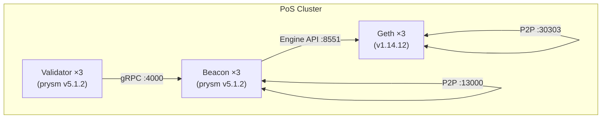

# OpenSpec: Go-Ethereum PoS Cluster (Production-Like)

## Status

Archived ✅

## Context

A production-like Ethereum Proof-of-Stake private chain running on a 3-node Minikube cluster. Three layers work together: the Execution Layer (Geth) processes transactions, the Consensus Layer (Beacon) coordinates block proposals, and Validators sign blocks and participate in consensus. All layers run as StatefulSets with 3 replicas, paired 1:1 across layers.

## Architecture



### Pairing

Each layer-N component connects to its paired counterpart:

- `validator-N` → `beacon-N.beacon-headless.web3.svc.cluster.local:4000`
- `beacon-N` → `geth-N.geth-headless.web3.svc.cluster.local:8551`

### Layer Responsibilities

| Layer           | Image                         | Role                                               | Ports                                     | PV  |
| --------------- | ----------------------------- | -------------------------------------------------- | ----------------------------------------- | --- |
| **Geth (EL)**   | `ethereum/client-go:v1.14.12` | Execute transactions, maintain state, P2P sync     | RPC 8545, WS 8546, Engine 8551, P2P 30303 | 5Gi |
| **Beacon (CL)** | `prysm/beacon-chain:v5.1.2`   | Coordinate consensus, assign proposers, drive Geth | gRPC 4000, HTTP 3500, P2P 13000/12000     | 5Gi |
| **Validator**   | `prysm/validator:v5.1.2`      | Hold keys, sign blocks, submit attestations        | Monitoring 8081                           | 1Gi |

## Requirements

### Requirement: Execution Layer (Geth)

The cluster SHALL run 3 Geth nodes as a StatefulSet with persistent chain data.

- Nodes SHALL auto-peer via a background script using `admin_nodeInfo` + `admin_addPeer` RPC calls.
- `--nat=extip:$POD_IP` SHALL be set via K8s downward API to advertise the real pod IP in enode URLs.
- State scheme SHALL be `path`, sync mode SHALL be `full`.
- Each node SHALL initialize genesis via an init container (`geth init`).
- Liveness/readiness probes SHALL use TCP on port 8545.

### Requirement: Consensus Layer (Beacon)

The cluster SHALL run 3 Beacon nodes (Prysm) as a StatefulSet.

- Each beacon-N SHALL connect to its paired geth-N via Engine API (port 8551) using JWT auth.
- Genesis state SHALL be generated per-pod via a `prysmctl` init container. A `check-db` init container SHALL skip genesis re-init if the beacon DB already exists (restart-safe).
- Ordinal-specific config SHALL be written by a busybox init container, read via `--config-file` (Prysm images are distroless).
- Beacon P2P peering SHALL be configured via an optional `beacon-peers` ConfigMap, populated by `make setup-beacon-peers`.
- Liveness probe SHALL use TCP on port 4000; readiness SHALL use HTTP `/eth/v1/node/health` on port 3500.

### Requirement: Validator Layer

The cluster SHALL run 3 Validator clients as a StatefulSet.

- 64 interop validator keys SHALL be sharded: (0–21), (22–43), (44–63).
- Each validator-N SHALL connect to its paired beacon-N via gRPC (port 4000).
- Monitoring SHALL be exposed on port 8081 with `/healthz` for liveness/readiness probes.

### Requirement: Chain Configuration

- **Chain ID**: 72390
- **Block Time**: 4 seconds per slot
- **Consensus**: PoS from genesis (TTD=0)
- **Forks**: All forks through Deneb at epoch 0; Electra disabled (far future epoch)
- **Pre-funded accounts**: 10 dev accounts × 1000 ETH

### Requirement: Persistent Storage

- 9 PVs using `hostPath` with `nodeAffinity` (3 per layer, pinned to Minikube nodes).
- `storageClassName: standard` in all VolumeClaimTemplates.

### Requirement: External Access

Geth RPC/WS and Beacon HTTP/gRPC accessible via `kubectl port-forward`.

## Manifests

```
deployments/kubernetes/minikube/geth-pos-cluster/
├── genesis-configmap.yaml    # Geth genesis (chain ID, funded accounts)
├── jwt-secret.yaml           # Shared JWT for Engine API
├── prysm-config.yaml         # CL chain config (forks, slots, deposit)
├── services.yaml             # Geth headless + ClusterIP
├── geth.yaml                 # Geth StatefulSet (3 replicas, auto-peer, --nat=extip)
├── beacon-services.yaml      # Beacon headless + ClusterIP
├── beacon.yaml               # Beacon StatefulSet (3 replicas, prysmctl genesis, P2P)
└── validator.yaml            # Validator StatefulSet (3 replicas, key sharding)
```

## Operations

### Full Lifecycle

```
Clean:  make delete-pos → cleanup-pos-pvc → cleanup-pos-pv → cleanup-pos-data
Deploy: make apply-pv → deploy-pos
Peer:   make setup-beacon-peers
Verify: make check-pos-status
```

### Graceful Stop / Start

```
Stop:   make stop-pos-graceful   (before minikube stop)
Start:  make start-pos-graceful  (auto-checks finality gap)
```

`start-pos-graceful` queries beacon head epoch vs current epoch. If gap > 10 epochs (~21 min), warns to run `make reset-pos-chain`.

### Node Repair

```
make repair-pos-node NODE=0   # clears geth-0 + beacon-0 data, re-syncs from peers
```

### Chain Reset

```
make reset-pos-chain   # stop → cleanup-pos-data → deploy-pos → setup-beacon-peers
```

Resets the entire chain with a new genesis time. All on-chain state is lost.

### `make setup-beacon-peers`

Queries each beacon's `/eth/v1/node/identity` via port-forward, creates a `beacon-peers` ConfigMap with multiaddr entries, and rollout restarts the beacon StatefulSet. Waits for the rolling restart to fully complete (`kubectl rollout status`) before deploying the `validator` StatefulSet. Must be re-run after any full redeployment.

## Known Constraints

- **Beacon Fork on Deploy (Resolved)**: Previously, `setup-beacon-peers` used a hard-coded `sleep 30` before deploying validators. The beacon rolling restart (ordinal 2→1→0) takes ~90s, so validators were deployed before beacon-0 restarted — validator-0 connected to the un-restarted beacon-0 (no peer config), causing a permanent minority fork. Fixed by replacing `sleep 30` with `kubectl rollout status statefulset/beacon`.

- **Distroless**: Prysm images have no shell. All dynamic config uses `--config-file` with init-container-generated YAML.
- **Beacon P2P**: Requires `make setup-beacon-peers` after first deploy or full redeployment (peer IDs change).
- **Interop keys**: Validator keys are auto-generated (insecure). Production would use real key management.
- **Shutdown Protection**: Geth uses `terminationGracePeriodSeconds: 120` with a `preStop` SIGINT hook (PathDB flush). Beacon uses `terminationGracePeriodSeconds: 60`. Always use `make stop-pos-graceful` before `minikube stop`.
- **Finality Gap**: If the cluster is stopped for >21 minutes without graceful shutdown, finality breaks permanently. Use `make reset-pos-chain` to recover.
