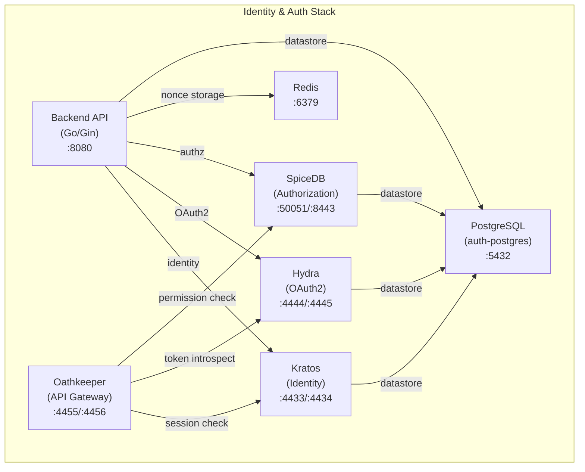

# OpenSpec: Identity & Authorization Stack (Ory + SpiceDB)

## Status

In Progress 🔧

## Context

An identity, OAuth2, API gateway, and authorization stack for the web3-lab platform, deployed via Kustomize to a local Minikube cluster. The stack consists of four Ory/AuthZed services adapted from the Account-System reference deployment, with key modifications for the web3-lab environment:

- **Namespace**: `web3` (instead of `diver-account`)
- **Domain**: Local development URLs (instead of `diver-service.io`)
- **SpiceDB datastore**: PostgreSQL (instead of Google Cloud Spanner)
- **Shared PostgreSQL**: New deployment for Hydra, Kratos, and SpiceDB databases
- **Monitoring**: No Datadog integration (stripped for local dev)
- **Overlay**: `minikube` only (no develop/stage/production)
- **TLS & Routing**: NGINX Ingress with automated TLS via Cert-Manager

## Documentation References

For detailed architectural diagrams, sequence flows, and operational guides, please refer to the dedicated documentation directory (`documents/identity-authorization-stack/`):
- [Architecture Overview & Component Interactions](../../../documents/identity-authorization-stack/architecture.md)
- [Web3 Authentication Sequence & API Gateway Flow](../../../documents/identity-authorization-stack/authentication-flow.md)
- [Local Minikube TLS & /etc/hosts Setup Guide](../../../documents/identity-authorization-stack/local-setup.md)
- [Health Endpoints & Functional Testing Guide](../../../documents/identity-authorization-stack/testing.md)

For the wallet authentication (SIWE) API design:
- [SIWE + EIP-712 Wallet Auth Spec](../siwe/spec.md)
- [SIWE OpenAPI 3.1 Spec](../siwe/openapi.yaml)

## Architecture



### Service Responsibilities

| Service        | Image                      | Role                                      | Ports                               |
| -------------- | -------------------------- | ----------------------------------------- | ----------------------------------- |
| **PostgreSQL** | `postgres:16-alpine`       | Shared database for auth services         | 5432                                |
| **Redis**      | `redis:7-alpine`           | Nonce storage for wallet auth             | 6379                                |
| **Hydra**      | `oryd/hydra:v2.2.0`       | OAuth2 & OpenID Connect provider          | Public 4444, Admin 4445             |
| **Kratos**     | `oryd/kratos:v1.2.0`      | Identity management (registration, login) | Public 4433, Admin 4434             |
| **Oathkeeper** | `oryd/oathkeeper:v0.40.9` | API gateway (authn/authz proxy)           | Proxy 4455, API 4456                |
| **SpiceDB**    | `authzed/spicedb:latest`  | Fine-grained authorization (Zanzibar)     | gRPC 50051, HTTP 8443, Metrics 9090 |
| **Backend API**| `web3-account-api:latest`  | Wallet auth, OAuth2 flows, account CRUD   | HTTP 8080                           |
| **Frontend App**| `web3-frontend:latest`     | SPA for E2E Auth Flow Testing             | HTTP 80                             |

## Requirements

### Requirement: PostgreSQL (Shared Database)

The stack SHALL deploy a PostgreSQL instance as the shared datastore.

- PostgreSQL SHALL use `postgres:16-alpine` image.
- A PVC SHALL provide persistent storage.
- An init script SHALL create databases for Hydra, Kratos, SpiceDB, and Account.
- A ClusterIP service `auth-postgres` SHALL expose port 5432.

### Requirement: Redis (Nonce Storage)

The stack SHALL deploy a Redis instance for wallet auth nonce storage.

- Redis SHALL use `redis:7-alpine` image with `appendonly yes`.
- A ClusterIP service `redis-service` SHALL expose port 6379.
- Liveness/readiness probes SHALL use `redis-cli ping`.

### Requirement: Hydra (OAuth2 Server)

The stack SHALL deploy Ory Hydra as the OAuth2/OIDC provider.

- An init container SHALL run `hydra migrate sql` before the main container starts.
- Configuration SHALL be mounted via a ConfigMap volume at `/etc/config/hydra/hydra.yml`.
- Environment-specific settings (URLs, CORS origins, secrets) SHALL be injected via `configMapRef` and `secretRef`.
- Two ClusterIP services SHALL be created: `hydra-public` (:4444) and `hydra-admin` (:4445).
- Ingress SHALL route `hydra.web3-local-dev.com` and `hydra-admin.web3-local-dev.com` via HTTPS to these services using Cert-Manager TLS.
- Liveness/readiness probes SHALL use HTTP on the admin port `/health/alive` and `/health/ready`.

### Requirement: Cert-Manager and Ingress
The stack SHALL utilize NGINX Ingress and Cert-Manager for local TLS termination.
- The Minikube `ingress` addon SHALL be enabled.
- `cert-manager` SHALL be deployed to provide local TLS certificates.
- A `SelfSigned` ClusterIssuer and a local CA `ClusterIssuer` (`local-ca-issuer`) SHALL be used to sign Ingress certificates.

### Requirement: Kratos (Identity Management)

The stack SHALL deploy Ory Kratos for identity management.

- Configuration SHALL be mounted via a ConfigMap volume at `/etc/config/kratos/kratos.yml`.
- Environment-specific settings SHALL be injected via `configMapRef` and `secretRef`.
- Two ClusterIP services SHALL be created: `kratos-public` (:4433) and `kratos-admin` (:4434).
- Ingress SHALL route `kratos.web3-local-dev.com` and `kratos-admin.web3-local-dev.com` via HTTPS to these services using Cert-Manager TLS.
- Liveness/readiness probes SHALL use HTTP on the admin port `/admin/health/alive` and `/admin/health/ready`.
- `oauth2_provider` SHALL be configured to point to Hydra admin (`:4445`) for seamless OAuth2 flow integration.
- Registration `after` hooks SHALL include `session` hook (first) and `web_hook` (second) for both `password` and `oidc` methods.
- The `session` hook is required so that Kratos creates a session after registration, enabling `oauth2_provider` to auto-accept the Hydra login and return `redirect_browser_to` (HTTP 422).
- Cookies SHALL be configured with `domain: .web3-local-dev.com`, `same_site: None`, and `path: /` for cross-subdomain compatibility.

### Requirement: Oathkeeper (API Gateway)

The stack SHALL deploy Ory Oathkeeper as the reverse proxy/API gateway.

- Configuration SHALL be mounted via a ConfigMap volume at `/etc/config/oathkeeper/oathkeeper.yml`.
- Environment-specific settings SHALL be injected via `configMapRef`.
- Two ClusterIP services SHALL be created: `oathkeeper-proxy` (:4455) and `oathkeeper-api` (:4456).
- Ingress SHALL route `auth.web3-local-dev.com` to proxy and `auth-api.web3-local-dev.com` to API via HTTPS using Cert-Manager TLS.
- Liveness/readiness probes SHALL use HTTP on the API port `/health/alive` and `/health/ready`.

### Requirement: SpiceDB (Authorization)

The stack SHALL deploy AuthZed SpiceDB for fine-grained authorization.

- SpiceDB SHALL use **PostgreSQL** as its datastore engine (NOT Spanner).
- The `--datastore-engine=postgres` flag SHALL be used.
- A `--datastore-conn-uri` flag SHALL point to the PostgreSQL DSN (via env var).
- An init container or migration Job SHALL run `spicedb datastore migrate head` with the PostgreSQL engine.
- Three ClusterIP services SHALL be created: `spicedb-http` (:8443), `spicedb-grpc` (:50051), `spicedb-metrics` (:9090).
- Ingress SHALL route `spicedb.web3-local-dev.com` via HTTPS using Cert-Manager TLS (with gRPC annotations for 50051).
- Liveness/readiness probes SHALL use `grpc_health_probe` on port 50051.
- Google Cloud credentials and Spanner-specific configs SHALL be removed.

### Requirement: Backend API

The stack SHALL deploy a Go/Gin backend API for wallet authentication and OAuth2 flows.

- The API image SHALL be `web3-account-api:latest` (built separately from Go source).
- The API SHALL connect to Kratos (admin + public), Hydra, SpiceDB, Redis, and PostgreSQL.
- `KRATOS_PUBLIC_URL` SHALL be configured to point to `http://kratos-public.web3.svc.cluster.local:4433` for session verification.
- A ClusterIP service `web3-api` SHALL expose port 8080.
- Ingress SHALL route `api.web3-local-dev.com` via HTTPS to `web3-api` using Cert-Manager TLS.
- Key routes: `/api/v1/auth/challenge` (nonce), `/api/v1/auth/verify` (signature), `/api/v1/oauth2/*` (Hydra flows).
- SIWE routes: `/api/v1/siwe/nonce` (EIP-4361 challenge), `/api/v1/siwe/verify` (standalone), `/api/v1/siwe/authenticate` (OAuth2-integrated).
- Admin routes: `/api/v1/admin/message-templates` (CRUD for sign-in message templates).
- `HandleLogin` SHALL check for existing Kratos sessions (via `/sessions/whoami` with forwarded browser cookies) when Hydra `skip=false`, auto-accepting the Hydra login if a valid session exists.
- `HandleLogout` SHALL revoke all Kratos sessions for the identity (via `DELETE /admin/identities/{id}/sessions`) before accepting the Hydra logout, to prevent auto-re-login via `HandleLogin`.
- For API architecture, endpoints, and operations details, see [api architecture](../../../documents/api/architecture.md).

### Requirement: Frontend App (Test UI)

The stack SHALL deploy a React/Vite frontend application to test the complete Auth flow.

- The frontend image SHALL be `web3-frontend:latest` (built via Docker multi-stage NGINX image).
- The frontend SHALL fetch configuration dynamically at runtime via `/config.json`.
- A ConfigMap `web3-frontend-config` SHALL inject the correct `config.json` via `subPath` into the NGINX root `/usr/share/nginx/html/config.json`.
- The HomePage SHALL auto-trigger the OAuth2 flow on mount, UNLESS the URL contains `?logout=true` (post-logout redirect), in which case it SHALL display a "Signed out" message with a manual Sign In button.
- A ClusterIP service `web3-frontend` SHALL expose port 80.
- Ingress SHALL route `app.web3-local-dev.com` via HTTPS to `web3-frontend` using Cert-Manager TLS.

### Requirement: Kustomize Structure

Each service SHALL follow the base/overlays Kustomize pattern:

```
deployments/kustomize/{service}/
├── base/
│   ├── kustomization.yaml
│   ├── deployment.yaml
│   └── service.yaml
└── overlays/
    └── minikube/
        ├── kustomization.yaml
        ├── configmap-env.yaml
        ├── ingress.yaml
        └── patch-deployment.yaml
```

- Base manifests SHALL be environment-agnostic.
- Overlay `minikube` SHALL set namespace to `web3`, configure local URLs, and adjust resource limits.
- Secrets SHALL be applied separately (not managed in Kustomize).

## Manifests

```
deployments/kustomize/
├── postgres/
│   ├── base/
│   │   ├── kustomization.yaml
│   │   ├── statefulset.yaml
│   │   ├── service.yaml
│   │   └── configmap-init.yaml     # Init script for multiple databases
│   └── overlays/minikube/
│       ├── kustomization.yaml
│       └── patch-statefulset.yaml
├── redis/
│   ├── base/
│   │   ├── kustomization.yaml
│   │   ├── deployment.yaml
│   │   └── service.yaml
│   └── overlays/minikube/
│       ├── kustomization.yaml
│       └── patch-deployment.yaml
├── hydra/
│   ├── base/
│   │   ├── kustomization.yaml
│   │   ├── deployment.yaml
│   │   ├── service.yaml
│   │   └── configmap-data/
│   │       └── configmap-config.yaml
│   └── overlays/minikube/
│       ├── kustomization.yaml
│       ├── configmap-env.yaml
│       ├── ingress.yaml
│       └── patch-deployment.yaml
├── kratos/
│   ├── base/
│   │   ├── kustomization.yaml
│   │   ├── deployment.yaml
│   │   └── service.yaml
│   └── overlays/minikube/
│       ├── kustomization.yaml
│       ├── configmap-env.yaml
│       ├── ingress.yaml
│       └── patch-deployment.yaml
├── oathkeeper/
│   ├── base/
│   │   ├── kustomization.yaml
│   │   ├── deployment.yaml
│   │   └── service.yaml
│   └── overlays/minikube/
│       ├── kustomization.yaml
│       ├── configmap-env.yaml
│       ├── ingress.yaml
│       └── patch-deployment.yaml
└── spicedb/
    ├── base/
    │   ├── kustomization.yaml
    │   ├── deployment.yaml
    │   └── service.yaml
    └── overlays/minikube/
        ├── kustomization.yaml
        ├── configmap-env.yaml
        ├── ingress.yaml
        ├── patch-deployment.yaml
        └── job-migrate.yaml
├── api/
│   ├── base/
│   │   ├── kustomization.yaml
│   │   ├── deployment.yaml
│   │   └── service.yaml
│   └── overlays/minikube/
│       ├── kustomization.yaml
│       ├── configmap-env.yaml
│       ├── configmap-config.yaml
│       ├── ingress.yaml
│       └── patch-deployment.yaml
```

## Operations

### Deploy All

```bash
make deploy-auth
```

### Deploy Individually

```bash
make deploy-auth-postgres
make deploy-redis
make deploy-hydra
make deploy-kratos
make deploy-oathkeeper
make deploy-spicedb
make deploy-api
```

### Verify

```bash
make check-auth-status
```

## Known Constraints

- **Secrets**: Must be created separately before deploying (DSN, preshared keys, system secrets).
- **PostgreSQL**: Must be deployed and ready before Hydra, Kratos, SpiceDB, and the API.
- **Redis**: Must be deployed before the API (needed for nonce storage).
- **API image**: Must be built (`make build-api`) and loaded (`make load-api`) before `make deploy-api`.
- **Config files**: Kratos and Oathkeeper require detailed config files (identity schemas, access rules) that will be environment-specific and added as overlay ConfigMaps.
- **Go backend code**: The actual Go source code for the API is a separate effort. This spec covers only the Kustomize deployment manifests.
