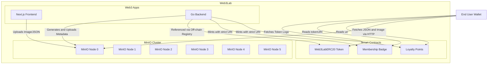

# OpenSpec: Decentralized Object Storage (MinIO)

## Status

Proposed ⏳

## Context

In web3 architectures, NFT (ERC-721) and MultiToken (ERC-1155) metadata is traditionally stored on IPFS or Arweave to ensure immutability. Similarly, ERC-20 token logos and token-list registries are often hosted statically. For a high-performance lab environment where access control, rapid iteration, and infrastructure management are prioritized, an S3-compatible storage layer provides the best balance.

This specification details the inclusion of **MinIO** as a 6-node distributed object storage cluster inside the `web3-lab` Minikube environment to serve as the URI endpoint for all Smart Contract Metadata (ERC-721, ERC-1155) and Token Logos (ERC-20).

## Architecture



## Implementation Details

1. **Topology**: 
   - A 6-replica StatefulSet deployed across the `web3-lab` Kubernetes nodes.
   - Persistent Storage: Six 10Gi Persistent Volumes bound to local host paths.
2. **Namespace**: 
   - All deployments, services, and pvcs must strictly operate within the `web3` namespace, inheriting the cluster configurations from the Geth PoS layer.
3. **Services**:
   - `minio-headless`: For internal cluster peer discovery (DNS).
   - `minio`: The ClusterIP service for API (port 9000) and Web Console (port 9001).
4. **Integration**:
   - The Go Backend interacts with MinIO via the standard AWS S3 SDK.
   - External access via `kubectl port-forward svc/minio 9000:9000 -n web3`.

## Bucket Structure

```
web3lab-assets/
├── erc20/
│   ├── 1.png .. 4.png         # ERC-20 token logos
├── erc721/
│   ├── images/
│   │   └── 0.png .. 3.png     # ERC-721 NFT artwork
│   └── metadata/
│       └── 0, 1, 2, 3         # ERC-721 JSON metadata (no extension)
└── erc1155/
    ├── images/
    │   └── 1.png .. 4.png     # ERC-1155 item artwork
    └── metadata/
        └── 1.json .. 4.json   # ERC-1155 JSON metadata
```

## URL Routing Strategy

> [!IMPORTANT]
> Metadata image URLs MUST use `http://localhost:9000/...` (via port-forward), NOT the internal Kubernetes DNS. Blockscout passes `image_url` from metadata directly to the user's browser, which cannot resolve `minio.web3.svc.cluster.local`.

| Consumer          | URL Format                                                    | Access Method      |
| ----------------- | ------------------------------------------------------------- | ------------------ |
| **User Browser**  | `http://localhost:9000/web3lab-assets/...`                    | `port-forward`     |
| **Smart Contract tokenURI** | `http://localhost:9000/web3lab-assets/erc721/metadata/` | Blockscout fetches via backend, image served to browser |
| **Backend (k8s)** | `http://minio.web3.svc.cluster.local:9000/web3lab-assets/...` | ClusterIP Service  |

## Content-Type Requirements

Metadata JSON files (especially those without `.json` extension like ERC-721) MUST be uploaded with explicit `Content-Type: application/json`. MinIO defaults to `application/octet-stream` for files without recognized extensions, which causes Blockscout's token instance fetcher to **blacklist** the URL and never retry.

```bash
# Upload with correct content-type
mc cp --attr "Content-Type=application/json" file.json web3lab/web3lab-assets/path/
```

## Seed Data Pipeline

```bash
make seed-upload          # Upload images + metadata to MinIO (sets correct Content-Type)
make test-interact        # Deploy tokens with tokenURIs pointing to MinIO
make seed-update-icons    # Fix Blockscout DB (ERC-20 icons + ERC-721 blacklisted metadata)
```
