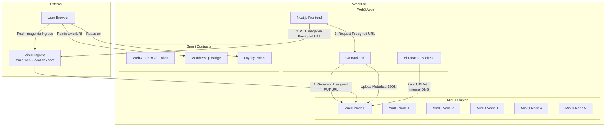
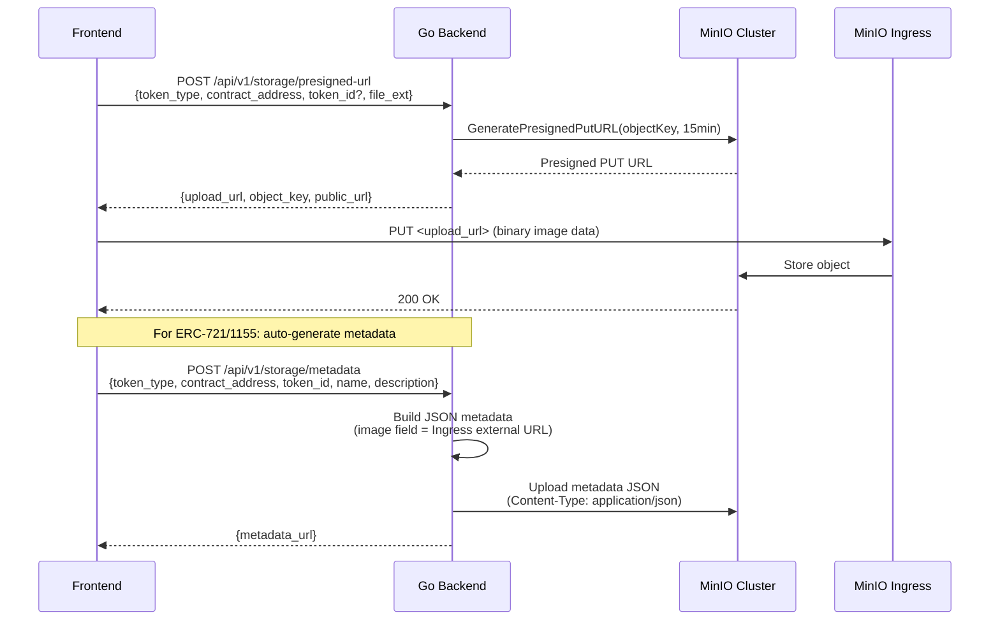

# OpenSpec: Decentralized Object Storage (MinIO)

## Status

In Progress 🚧

## Context

In web3 architectures, NFT (ERC-721) and MultiToken (ERC-1155) metadata is traditionally stored on IPFS or Arweave to ensure immutability. Similarly, ERC-20 token logos and token-list registries are often hosted statically. For a high-performance lab environment where access control, rapid iteration, and infrastructure management are prioritized, an S3-compatible storage layer provides the best balance.

This specification details the inclusion of **MinIO** as a 6-node distributed object storage cluster inside the `web3-lab` Minikube environment to serve as the URI endpoint for all Smart Contract Metadata (ERC-721, ERC-1155) and Token Logos (ERC-20), with **dynamic upload** support via Presigned URLs.

## Architecture



## Implementation Details

1. **Topology**:
   - A 6-replica StatefulSet deployed across the `web3-lab` Kubernetes nodes.
   - Persistent Storage: Six 10Gi Persistent Volumes bound to local host paths.
2. **Namespace**:
   - All deployments, services, and pvcs must strictly operate within the `web3` namespace, inheriting the cluster configurations from the Geth PoS layer.
3. **Services**:
   - `minio-headless`: For internal cluster peer discovery (DNS).
   - `minio`: The ClusterIP service for API (port 9000) and Web Console (port 9001).
4. **Ingress** (Dedicated):
   - Host: `minio.web3-local-dev.com`
   - TLS via cert-manager `local-ca-issuer`
   - Routes to `minio` ClusterIP service on port 9000
   - MinIO does **NOT** route through APISIX — it has its own dedicated Ingress for asset serving
5. **Integration**:
   - The Go Backend interacts with MinIO via the **MinIO Go SDK** (`github.com/minio/minio-go/v7`).
   - Frontend uploads directly to MinIO via **Presigned PUT URLs** generated by the Backend.

## Bucket Structure

```
web3lab-assets/
├── erc20/
│   └── {contract_address}.png           # ERC-20 token logos (keyed by contract address)
├── erc721/
│   ├── {contract_address}/
│   │   ├── images/
│   │   │   └── {token_id}.png           # ERC-721 NFT artwork
│   │   └── metadata/
│   │       └── {token_id}               # ERC-721 JSON metadata (no extension)
└── erc1155/
    └── {contract_address}/
        ├── images/
        │   └── {token_id}.png           # ERC-1155 item artwork
        └── metadata/
            └── {token_id}.json          # ERC-1155 JSON metadata
```

> [!NOTE]
> Dynamic uploads use `contract_address` as a namespace key within each token standard directory, isolating assets per deployed contract.

## URL Routing Strategy (Dual URL)

> [!IMPORTANT]
> Two different URL bases are used depending on the consumer:
>
> - **On-chain `tokenURI`** (consumed by Blockscout backend inside k8s): Internal DNS
> - **Metadata `image` field** (consumed by user browser): External Ingress URL
>
> This ensures Blockscout can fetch metadata internally, while browsers render images via the public Ingress.

| Consumer                                  | URL Format                                                                                  | Access Method             |
| ----------------------------------------- | ------------------------------------------------------------------------------------------- | ------------------------- |
| **User Browser**                          | `https://minio.web3-local-dev.com/web3lab-assets/...`                                       | Dedicated Ingress (TLS)   |
| **On-chain tokenURI** (ERC-721 `baseURI`) | `http://minio.web3.svc.cluster.local:9000/web3lab-assets/erc721/{addr}/metadata/`           | K8s Internal DNS          |
| **On-chain uri** (ERC-1155)               | `http://minio.web3.svc.cluster.local:9000/web3lab-assets/erc1155/{addr}/metadata/{id}.json` | K8s Internal DNS          |
| **Backend (k8s)**                         | `http://minio.web3.svc.cluster.local:9000/web3lab-assets/...`                               | ClusterIP Service         |
| **Frontend Presigned PUT**                | `https://minio.web3-local-dev.com/web3lab-assets/...?X-Amz-...`                             | Presigned URL via Ingress |

## Dynamic Upload Flow (Presigned URL)



### ERC-20 Icon Flow

ERC-20 has no on-chain `tokenURI` standard. After uploading the icon image:

1. Backend uploads icon to `erc20/{contract_address}.png`
2. Backend updates Blockscout Postgres: `UPDATE tokens SET icon_url = '...' WHERE contract_address_hash = ...`

## MinIO CORS Configuration

For Presigned PUT uploads from the browser, MinIO itself must allow CORS:

```yaml
# Environment variables on MinIO StatefulSet
- name: MINIO_API_CORS_ALLOW_ORIGIN
  value: "https://app.web3-local-dev.com,https://app.web3-local-dev-2.com,https://app.web3-local-dev.net,https://app.web3-local-dev-2.net,http://localhost:3000"
```

## Content-Type Requirements

Metadata JSON files (especially those without `.json` extension like ERC-721) MUST be uploaded with explicit `Content-Type: application/json`. MinIO defaults to `application/octet-stream` for files without recognized extensions, which causes Blockscout's token instance fetcher to **blacklist** the URL and never retry.

## Blockscout SSRF Configuration

By default, Blockscout's Elixir indexer employs strict **Server-Side Request Forgery (SSRF)** protection, which actively drops HTTP requests resolving to internal or private Kubernetes IP addresses (e.g., `10.x.x.x` ranges mapping to `minio.web3.svc.cluster.local`).
To permit Blockscout to fetch internal MinIO data seamlessly, you MUST inject the following environment variable into the `blockscout-backend` deployment:
```yaml
- name: INDEXER_TOKEN_INSTANCE_HOST_FILTERING_ENABLED
  value: "false"
```

## ERC-1155 TokenID Hex Padding (EIP-1155)

The official ERC-1155 standard mandates that clients resolving the `{id}` substitution string within the contract URI must replace the `{id}` token with a **64-character zero-padded lowercase hexadecimal string**.
Consequently, the internal MinIO backend `storage_service.go` generator natively formats incoming token IDs (e.g. string `"0"` -> `"0000...0000"`) prior to generating presigned URLs and writing JSON files.
- **Incorrect:** `0.png`, `14.json`
- **Correct:** `0000000000000000000000000000000000000000000000000000000000000000.png`

## Ingress Configuration

```yaml
# Dedicated MinIO Ingress (NOT through APISIX)
apiVersion: networking.k8s.io/v1
kind: Ingress
metadata:
  name: minio-ingress
  namespace: web3
  annotations:
    cert-manager.io/cluster-issuer: local-ca-issuer
spec:
  ingressClassName: nginx
  tls:
    - hosts:
        - minio.web3-local-dev.com
      secretName: minio-tls
  rules:
    - host: minio.web3-local-dev.com
      http:
        paths:
          - path: /
            pathType: Prefix
            backend:
              service:
                name: minio
                port:
                  number: 9000
```

> [!NOTE]
> MinIO serves assets directly via its own Ingress because:
>
> 1. MinIO is an object store, not an API — routing through APISIX adds unnecessary latency
> 2. MinIO has built-in CORS, ACL, and rate limiting
> 3. Separation of concerns: API gateway for APIs, object store for assets
> 4. Mirrors production patterns (CDN → S3, not API Gateway → S3)

## Seed Data Pipeline

```bash
make seed-upload          # Upload images + metadata to MinIO (sets correct Content-Type)
make test-interact        # Deploy tokens with tokenURIs pointing to MinIO
make seed-update-icons    # Fix Blockscout DB (ERC-20 icons + ERC-721 blacklisted metadata)
```

## Backend API Endpoints

| Method | Path                            | Purpose                                          |
| ------ | ------------------------------- | ------------------------------------------------ |
| `POST` | `/api/v1/storage/presigned-url` | Generate presigned PUT URL for image upload      |
| `POST` | `/api/v1/storage/metadata`      | Generate and upload metadata JSON (ERC-721/1155) |
| `POST` | `/api/v1/storage/erc20-icon`    | Upload ERC-20 icon + update Blockscout DB        |
