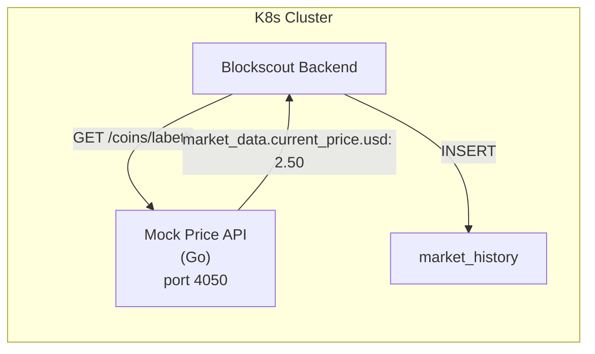

# OpenSpec: Native Token Pricing (labETH)

## Status

Done ✅

## Context

Blockscout displays native token pricing on the main dashboard (`coin_price`, `market_cap`, price charts). By default, the backend fetches pricing from **CoinGecko** using the `COIN` env var. Since `labETH` is a private chain token not listed on any exchange, all pricing fields showed `null`.

### Result

```json
{
  "coin_price": "2.48"
}
```

## Architecture

A lightweight **mock CoinGecko API** written in Go at `backend/cmd/mock-price/`. Blockscout fetches pricing from this in-cluster service.



## Implementation

### Source

| File                             | Description                         |
| -------------------------------- | ----------------------------------- |
| `backend/go.mod`                 | Go 1.26 module                      |
| `backend/cmd/mock-price/main.go` | ~150 lines, stdlib-only HTTP server |

### Endpoints

| Path                           | Purpose                                                           |
| ------------------------------ | ----------------------------------------------------------------- |
| `GET /coins/{id}`              | Current price (CoinGecko `/coins/{id}` format with `market_data`) |
| `GET /coins/{id}/market_chart` | Historical chart (365 days, random walk)                          |
| `GET /simple/price`            | Simple price endpoint                                             |
| `GET /health`                  | Liveness probe                                                    |

### Env Vars

| Variable          | Default       | Description       |
| ----------------- | ------------- | ----------------- |
| `MOCK_PRICE_USD`  | `2.50`        | Base USD price    |
| `MOCK_MARKET_CAP` | `25000000000` | Market cap        |
| `MOCK_24H_VOLUME` | `1000000`     | 24h volume        |
| `MOCK_PORT`       | `4050`        | Listen port       |
| `MOCK_COIN_ID`    | `labeth`      | CoinGecko coin ID |

### Deployment

| Path                                                  | Description                                         |
| ----------------------------------------------------- | --------------------------------------------------- |
| `deployments/build/mock-price/Dockerfile`             | Multi-stage Go 1.26 → Alpine 3.20                   |
| `deployments/kustomize/mock-price/base/`              | Base k8s manifests                                  |
| `deployments/kustomize/mock-price/overlays/minikube/` | Minikube overlay (ns: web3, imagePullPolicy: Never) |

### Blockscout Config

```yaml
# blockscout.yaml
- name: MARKET_COINGECKO_BASE_URL
  value: "http://mock-price-api:4050"
- name: MARKET_COINGECKO_COIN_ID
  value: "labeth"
```

> [!IMPORTANT]
> Deprecated names `EXCHANGE_RATES_COIN_GECKO_BASE_URL` / `EXCHANGE_RATES_COINGECKO_COIN_ID` do NOT work in Blockscout v6.4+. Use `MARKET_COINGECKO_*`.

### Makefile Targets

| Target              | Action                               |
| ------------------- | ------------------------------------ |
| `build-mock-price`  | Docker build with VERSION tag        |
| `load-mock-price`   | Minikube image load                  |
| `deploy-mock-price` | Kustomize edit image + kubectl apply |
| `delete-mock-price` | kubectl delete                       |

## Task List

- [x] Write Go source (`backend/cmd/mock-price/main.go`)
- [x] Initialize `backend/go.mod` (Go 1.26 via pixi)
- [x] Create Dockerfile (`deployments/build/mock-price/Dockerfile`)
- [x] Create kustomize base/overlay (`deployments/kustomize/mock-price/`)
- [x] Add Makefile targets + versioning (`bump-{major,minor,patch}`)
- [x] Update Blockscout config (`MARKET_COINGECKO_BASE_URL`)
- [x] Build, load, deploy (`make build-mock-price load-mock-price deploy-mock-price`)
- [x] Verify `coin_price` shows in Blockscout stats API ✅ `"coin_price":"2.48"`

## Troubleshooting Notes

1. **`EXCHANGE_RATES_*` vs `MARKET_*`**: Blockscout v6.4+ renamed env vars. Old names silently ignored.
2. **CoinGecko API path**: Blockscout calls `/coins/{id}` not `/api/v3/simple/price`. The mock must handle both `/coins/` prefix routes.
3. **Docker layer caching**: When rebuilding with same tag, use `--no-cache` or bump version (`make bump-patch`) to ensure Minikube picks up new image.
