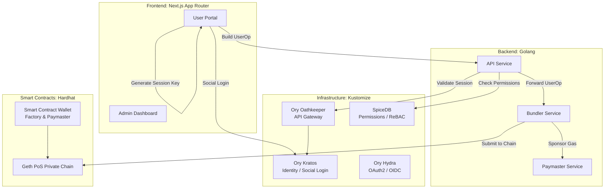

# OpenSpec: Web3-Lab Overall Architecture

## Status

In Progress ⏳

### Current Progress
- **✅ Phase 1: Project Setup**: Completed (Monorepo Workspace, Node v22.x Pixi Env, Root Makefile).
- **✅ Phase 2: Smart Contracts**: Completed (ERC-4337 Wallet/Factory, Paymaster, Mocks, Hardhat Tests, Deployment Scripts).
- **⏳ Phase 3: Frontend**: Pending (Next.js User Portal & Web3 auth hooking).
- **🔧 Phase 4: Backend**: In Progress (Golang API, SIWE wallet auth, message templates, Hydra OAuth2 integration).
- **⏳ Phase 5: Infrastructure**: Pending (Ory Kratos/Hydra, SpiceDB).

## Context

The `web3-lab` project aims to build a modern Web3 application featuring a **Smart Contract Wallet** with **Account Abstraction (ERC-4337)**. To provide a seamless Web2-like user experience, the system eliminates the need for traditional wallet extensions (like MetaMask) by integrating **Social Login** (Google, Apple, etc.) via the Ory ecosystem. Fine-grained permissions and authorization are handled by SpiceDB.

## Architecture



## Directory Structure

```text
web3-lab/
├── contracts/               # Smart Contracts (Hardhat)
│   ├── contracts/           # Solidity Code (AA Wallet Factory, Paymaster, etc.)
│   ├── scripts/             # Deployment Scripts
│   ├── test/                # Test Cases
│   └── hardhat.config.ts
├── deployments/kustomize/   # Infrastructure Configuration (Kustomize)
│   ├── api/                 # API backend deployment manifests
│   ├── hydra/               # Ory Hydra (OAuth2/OIDC)
│   ├── kratos/              # Ory Kratos (Identity/Login)
│   ├── oathkeeper/          # Ory Oathkeeper (API Gateway)
│   ├── redis/
│   └── spicedb/             # Permission schema & deploy config
├── backend/                 # Golang Backend Services
│   ├── cmd/                 # Microservice Entrypoints
│   │   ├── api/             # Main API Gateway / Bridge
│   │   ├── bundler/         # ERC-4337 UserOperation Bundler
│   │   └── paymaster/       # Gas Sponsoring Paymaster Service
│   ├── internal/            # Core Business Logic
│   └── pkg/                 # Shared Go Packages (Web3 SDK, Ory Client, DB)
├── scripts/                 # Utility scripts (e.g. get eth info, test tx, contract info)
└── frontend/                # Frontend Applications (Node.js / Next.js)
    ├── user-portal/         # Main DApp for end-users (App Router, Social Login)
    │   ├── src/app/         # Next.js Routes
    │   ├── src/components/  # UI Components
    │   ├── src/hooks/       # React Hooks (useWallet, useAuth)
    │   └── src/lib/         # SDK clients (Ory, AA, Viem)
    └── admin-dashboard/     # Internal Admin Panel
```

## Layer Responsibilities

| Component     | Tech Stack           | Role                                                                 |
| :------------ | :------------------- | :------------------------------------------------------------------- |
| **Frontend**  | Next.js (App Router) | UI, Social Login redirect, Generate local Session/Ephemeral Key      |
| **Backend**   | Golang               | API Gateway bridging Web2 Auth and Web3 UserOps, Bundler integration |
| **Auth**      | Ory (Kratos, Hydra)  | Manage User Identities, Social Login flows, OAuth2                   |
| **Authz**     | SpiceDB              | Relational Based Access Control (ReBAC) for Wallet operations        |
| **Contracts** | Hardhat, Solidity    | Account Abstraction (ERC-4337) Wallet, Factory, Paymaster            |
| **Chain**     | Geth PoS             | The underlying local private testnet                                 |
| **Scripts**   | JS/TS/Go/Bash        | Utility tools to query chain info, test transactions, etc.           |

## User Flow (Social Login to Transaction)

1. **Login**: User visits Frontend, clicks "Login with Google". Redirected to Ory Kratos.
2. **Identity**: Kratos authenticates the user and creates a session.
3. **Session Key**: Frontend generates an ephemeral ECDSA key pair (Session Key) locally.
4. **Wallet Mapping**: Backend maps the Kratos Identity ID to a deterministic Smart Contract Wallet address (e.g., via CREATE2).
5. **Authorization**: Backend (or Oathkeeper/SpiceDB) registers the Session Key as an authorized signer for the Wallet.
6. **Transaction**: Frontend signs a `UserOperation` with the Session Key and sends it to the Backend.
7. **Execution**: Backend validates the session via SpiceDB/Kratos, appends Paymaster data (if sponsoring gas), and forwards the transaction to the Bundler -> Geth Chain.
