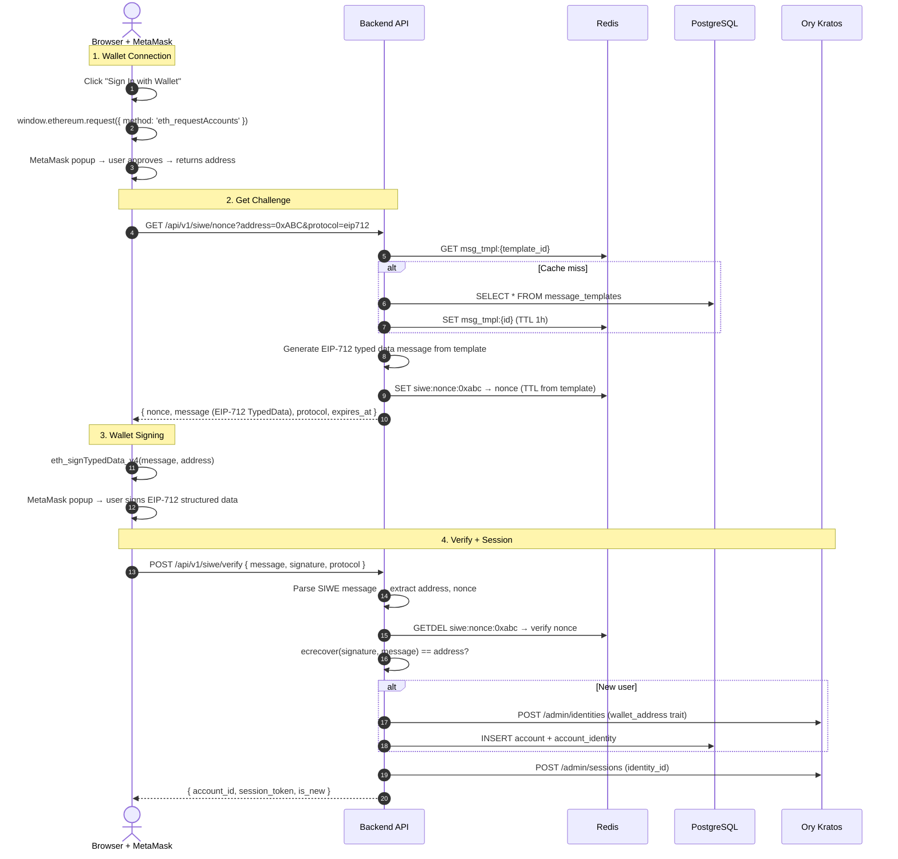
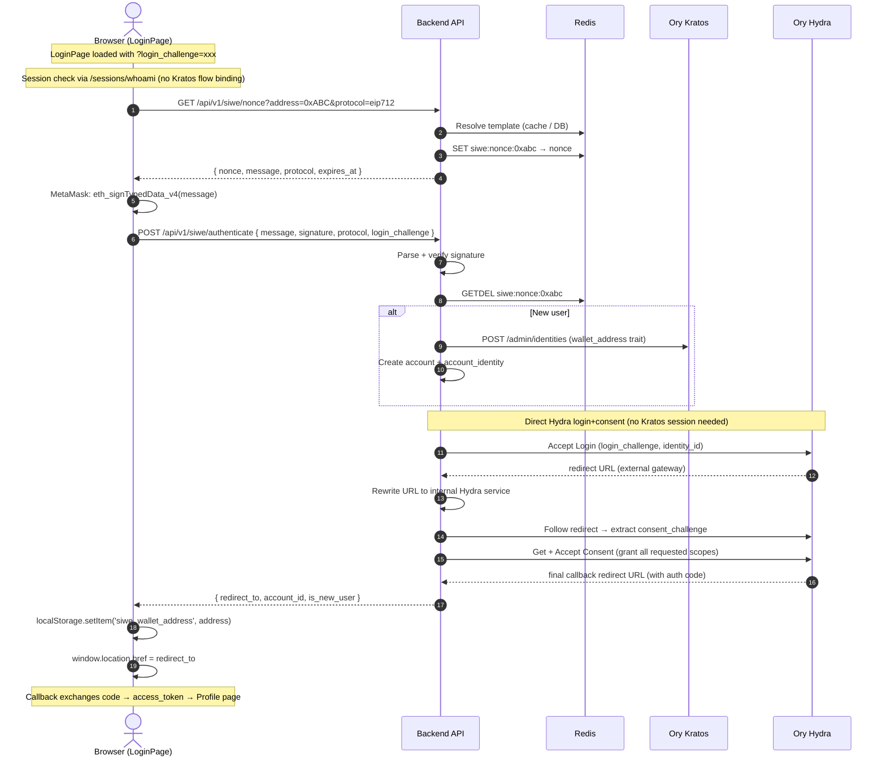

# OpenSpec: Wallet Authentication (SIWE + EIP-712)

## Status

Completed ✅

## Context

Add dual-protocol wallet authentication to the web3-lab backend API, supporting
**EIP-4361 (SIWE)** via `personal_sign` and **EIP-712** via `eth_signTypedData_v4`.

### Problem with Account-System Approach

The Account-System stores per-client sign-in message configs in a ConfigMap
(`CLIENT_AUTH_CONFIG`). This has several issues:

- Every message change requires a ConfigMap edit + pod restart
- Duplicate message templates across clients
- `custom_message: true` + `message_templates` is a bolted-on pattern
- No admin UI/API to manage templates

### New Design

Store **message templates** in PostgreSQL, cache in Redis. App clients reference
templates via FK. Admin API provides CRUD. This separates message configuration
from deployment config.

## API Design

Full OpenAPI 3.1 spec: [`openapi.yaml`](./openapi.yaml)

### Wallet Auth Endpoints

| Method | Path                        | Purpose                                    |
| :----- | :-------------------------- | :----------------------------------------- |
| GET    | `/api/v1/siwe/nonce`        | Generate nonce + formatted sign-in message |
| POST   | `/api/v1/siwe/verify`       | Verify signature → Kratos session          |
| POST   | `/api/v1/siwe/authenticate` | Verify signature → Hydra OAuth2 redirect   |

### Message Template Admin Endpoints

| Method | Path                                   | Purpose         |
| :----- | :------------------------------------- | :-------------- |
| GET    | `/api/v1/admin/message-templates`      | List templates  |
| POST   | `/api/v1/admin/message-templates`      | Create template |
| GET    | `/api/v1/admin/message-templates/{id}` | Get template    |
| PUT    | `/api/v1/admin/message-templates/{id}` | Update template |
| DELETE | `/api/v1/admin/message-templates/{id}` | Delete template |

## Database Schema

```sql
CREATE TABLE message_templates (
    id             UUID PRIMARY KEY DEFAULT gen_random_uuid(),
    name           VARCHAR(100) UNIQUE NOT NULL,  -- "default", "nms", "rewards"
    protocol       VARCHAR(10) NOT NULL,          -- "siwe" or "eip712"
    statement      TEXT NOT NULL,                 -- "Sign in to {service_name}"
    domain         VARCHAR(255) NOT NULL,         -- "web3-local-dev.com"
    uri            VARCHAR(500) NOT NULL,         -- "https://app.web3-local-dev.com"
    chain_id       INTEGER NOT NULL DEFAULT 1,
    version        VARCHAR(10) NOT NULL DEFAULT '1',
    nonce_ttl_secs INTEGER NOT NULL DEFAULT 300,
    created_at     TIMESTAMPTZ DEFAULT NOW(),
    updated_at     TIMESTAMPTZ DEFAULT NOW()
);

-- FK from app_clients → message_templates
ALTER TABLE app_clients
    ADD COLUMN message_template_id UUID REFERENCES message_templates(id);
```

**Relationship:**

```
app_clients (N) ──FK──→ (1) message_templates
```

- Multiple clients can share one template
- A `name = "default"` template is the fallback
- Template changes propagate to all linked clients immediately (after cache invalidation)

## Redis Cache Strategy

```
Key:    msg_tmpl:{template_id}
Value:  JSON of MessageTemplate
TTL:    1 hour

Key:    siwe:nonce:{address}
Value:  nonce string
TTL:    template.nonce_ttl_secs (default 300s)
```

- On template CREATE/UPDATE/DELETE → invalidate `msg_tmpl:{id}`
- Nonce endpoint: resolve template from cache (miss → DB → cache), then generate message + store nonce
- `GETDEL` on nonce verify ensures one-time use

## Authentication Flows

### MetaMask Connection + SIWE Sign-In (Standalone)



### SIWE + OAuth2 Flow (Hydra-Integrated)



> **Implementation Note:** The SIWE flow bypasses Kratos session creation
> (Kratos v1.2.0 doesn't support `POST /admin/sessions`) and directly
> accepts Hydra login+consent. The `AcceptLoginRequest` redirect URL uses
> the external gateway hostname which is unreachable from inside the cluster,
> so it is rewritten to the internal Hydra public service URL via
> `rewriteToInternalURL()`.

## Requirements

### Requirement: Dual-Protocol Support

- The API SHALL support both `siwe` (EIP-4361 / EIP-191) and `eip712` protocols.
- The `protocol` parameter on the nonce endpoint determines the message format.
- SIWE messages SHALL conform to the EIP-4361 ABNF.
- EIP-712 messages SHALL use the typed data structure (domain separator + AuthMessage).
- The verify endpoint uses `protocol` to determine the verification method.

### Requirement: Message Templates in PostgreSQL

- Sign-in message configurations SHALL be stored in the `message_templates` table.
- Each template defines: name, protocol, statement, domain, URI, chain_id, version, nonce_ttl_secs.
- The `statement` field SHALL support `{service_name}` variable substitution.
- A template with `name = "default"` SHALL exist as the fallback.
- `app_clients.message_template_id` FK links a client to its template.

### Requirement: Redis Caching

- Resolved templates SHALL be cached in Redis (`msg_tmpl:{id}`, TTL 1 hour).
- Template CRUD operations SHALL invalidate the cache for the affected template.
- Nonces SHALL be stored in Redis (`siwe:nonce:{address}`, TTL from template).
- Nonces SHALL be consumed via `GETDEL` (one-time use).

### Requirement: Admin API

- Admin CRUD endpoints SHALL be provided for message templates.
- Delete SHALL be rejected if the template is still referenced by app_clients (FK constraint).
- Create/Update/Delete SHALL invalidate the Redis cache.

### Requirement: Signature Verification

- SIWE: parse message → extract address + nonce → EIP-191 `ecrecover`.
- EIP-712: parse JSON → reconstruct typed data hash → `ecrecover`.
  - The typing schema MUST match the generated JSON exact structure (`EIP712Domain` and `AuthMessage`).
  - The hash reconstruction SHALL be implemented using `github.com/ethereum/go-ethereum/signer/core/apitypes`.
  - `apitypes.TypedDataAndHash(typedData)` provides the correct Keccak256 hash `\x19\x01 + domainSeparator + hashStruct(message)`.
- Recovered address compared case-insensitively.
- Nonce must exist in Redis and match.

### Requirement: Identity + Session Management

- After verification, look up Kratos identity by `wallet_address` trait.
- Create identity + account if not found (provider: `eoa`).
- For `/authenticate`: directly accept Hydra login + auto-accept consent, return final redirect URL.
- Kratos session creation is NOT required for the OAuth2 flow — `AcceptLoginRequest` uses identity_id as subject.

### Requirement: Kratos Identity Schema

- The Kratos identity schema SHALL support both `email` and `wallet_address` traits.
- `wallet_address` SHALL use pattern `^0x[a-fA-F0-9]{40}$`.
- Neither `email` nor `wallet_address` is required at the schema level (validation at application layer).
- `additionalProperties` SHALL be `false` to prevent unknown traits.

### Requirement: Frontend Integration

- LoginPage SHALL check session via `/sessions/whoami` on load (NOT `login/browser?login_challenge=xxx` which would bind the Hydra challenge to Kratos).
- SIWE button SHALL use `eth_requestAccounts` to get the currently active MetaMask wallet.
- On successful SIWE auth, wallet address SHALL be persisted in `localStorage('siwe_wallet_address')`.
- If `authenticate` returns "expired" or "unauthorized", the stale `loginChallenge` SHALL be cleared and a fresh OAuth2 flow initiated.
- ProfilePage SHALL display wallet address, auth method (SIWE/EIP-4361), and identity_id for wallet users.
- Logout SHALL clear `access_token`, `loginChallenge`, `siwe_wallet_address`, and revoke MetaMask permissions.

## Backend Changes

### New Files

| File                                                    | Description                                                                |
| :------------------------------------------------------ | :------------------------------------------------------------------------- |
| `backend/internal/handlers/siwe_handler.go`             | Wallet auth endpoints (nonce, verify, auth)                                |
| `backend/internal/handlers/message_template_handler.go` | Admin CRUD for message templates                                           |
| `backend/internal/services/siwe_service.go`             | SIWE/EIP-712 message gen, parse, verify + Hydra OAuth2 consent auto-accept |
| `backend/internal/services/message_template_service.go` | Template CRUD + Redis cache                                                |
| `backend/internal/database/query/message_templates.sql` | sqlc queries for message_templates table                                   |
| `migrations/postgres/000004_message_templates.up.sql`   | DB migration (table + FK + seed)                                           |
| `migrations/postgres/000004_message_templates.down.sql` | Rollback migration                                                         |

### Modified Files

| File                                                                     | Change                                                                      |
| :----------------------------------------------------------------------- | :-------------------------------------------------------------------------- |
| `backend/internal/server/router.go`                                      | Add `/api/v1/siwe/*` and admin routes                                       |
| `backend/internal/server/server.go`                                      | Wire new handlers + services                                                |
| `backend/internal/config/config.go`                                      | Add SIWE fallback config fields (domain: `app.web3-local-dev.com`)          |
| `backend/internal/database/repository.go`                                | Add `MessageTemplate` model + repository                                    |
| `backend/internal/database/postgres.go`                                  | Implement `MessageTemplateRepository`                                       |
| `backend/internal/services/hydra_client_service.go`                      | Add `PublicURL()` getter for internal URL rewriting                         |
| `deployments/kustomize/kratos/base/configmap-data/configmap-config.yaml` | Add `wallet_address` trait to identity schema, remove `email` from required |
| `frontend/app/src/pages/LoginPage.tsx`                                   | SIWE login flow, stale challenge detection, wallet address persistence      |
| `frontend/app/src/pages/ProfilePage.tsx`                                 | Wallet address display, disconnect/logout button                            |

### Reused Services

- `NonceService` — nonce gen/verify in Redis (new key prefix `siwe:nonce:`)
- `AuthService` — `VerifySignature()` for EIP-191 ecrecover
- `KratosAdminService` — identity creation (wallet_address trait)
- `AccountService` — account CRUD
- `HydraClientService` — OAuth2 login/consent + `PublicURL()` for URL rewriting

## Task List

See [`openspec/changes/siwe/tasks.md`](../../changes/siwe/tasks.md) for the full implementation checklist.


## Verification Plan

### Automated Tests

```bash
# Unit: message generation (SIWE + EIP-712)
go test ./backend/internal/services/ -run TestSIWEMessage -v
go test ./backend/internal/services/ -run TestEIP712Message -v

# Unit: signature verification
go test ./backend/internal/services/ -run TestVerifySignature -v

# Unit: template CRUD + cache invalidation
go test ./backend/internal/services/ -run TestMessageTemplate -v

# Integration: full nonce → sign → verify flow
# (requires running Redis + PostgreSQL)
```

### Manual Verification

1. Seed a default message template via Admin API
2. Connect MetaMask on LoginPage
3. Click "Sign In with Wallet" → verify MetaMask shows correct SIWE message
4. Sign → verify redirect to profile page
5. Update template statement via Admin API → verify new message on next sign-in
