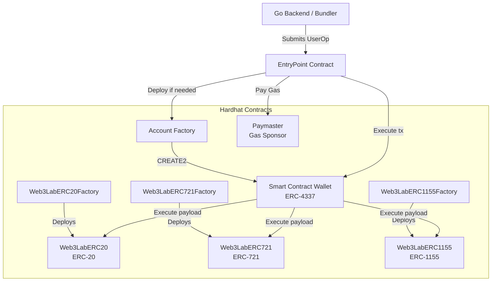
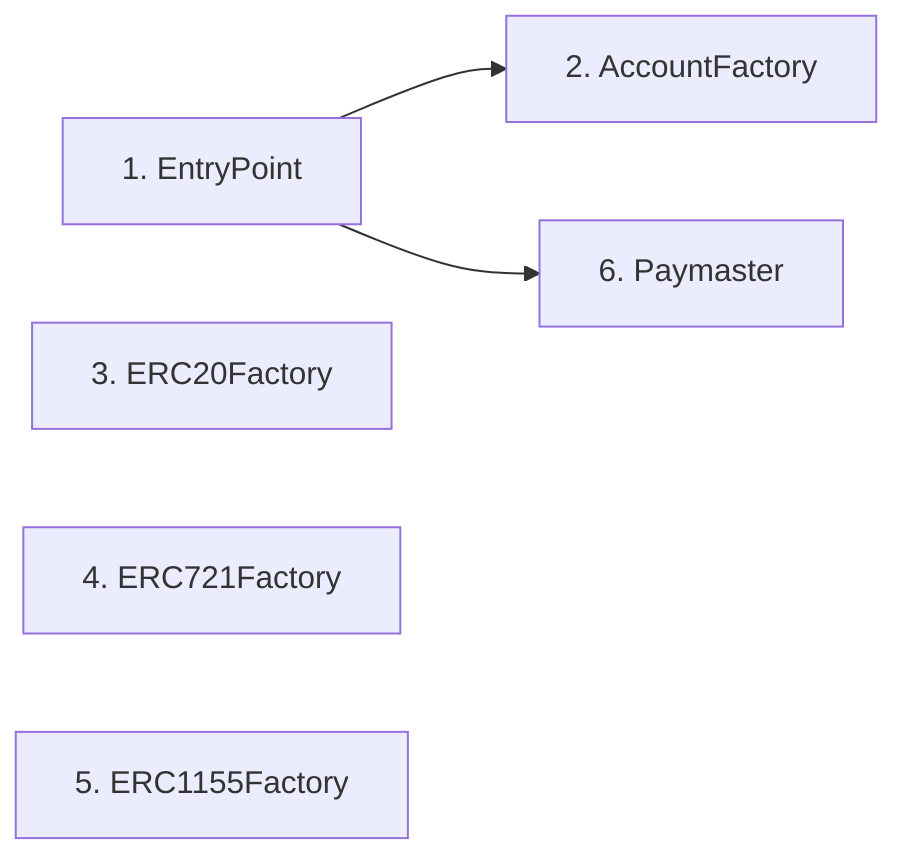

# OpenSpec: Smart Contract Assets & ERC-4337 Architecture

## Status

Implemented ✅

## Context

The `web3-lab` project utilizes **Account Abstraction (ERC-4337)** as the foundational layer for all user accounts. Instead of Externally Owned Accounts (EOAs), every user interacts via a deterministic Smart Contract Wallet (SCW). This specification details how the SCW manages other on-chain standard assets: **ERC-20 (Fungible Tokens)**, **ERC-721 (Non-Fungible Tokens)**, and **ERC-1155 (Multi-Tokens)**, and how these contracts will be structured and deployed using **Hardhat**.

## Architecture



## Implementation Strategy (Inheritance & Factories)

To ensure maximum security and avoid reinventing the wheel, the contracts in this project heavily rely on **Inheritance** from industry-standard libraries:

- **OpenZeppelin Contracts** (`@openzeppelin/contracts`): Provides the full, audited implementation of ERC-20, ERC-721, and ERC-1155. Our custom mock contracts (e.g., `MockUSDC.sol`) are intentionally small (often < 20 lines) because they inherit 100% of the standard logic (like `transfer`, `approve`, `balanceOf`) from OpenZeppelin under the hood.
- **Account Abstraction Contracts** (`@account-abstraction/contracts`): Our Smart Contract Wallet (`Web3LabAccount.sol`) inherits from the official `SimpleAccount.sol`. It automatically supports ERC-4337 validation and execution out of the box.

### The Factory Pattern

As designed in ERC-4337, users do not deploy their own Smart Contract Wallets manually. Instead, the architecture utilizes a **Factory Contract** (`Web3LabAccountFactory.sol`). When a user sends their very first `UserOperation` through the Backend/Bundler, the EntryPoint contract calls the Factory. The Factory uses the `CREATE2` opcode to deterministically deploy the user's isolated `Web3LabAccount` contract exactly when it is needed.

## Asset Standards & Usage

### 1. Smart Contract Wallet (ERC-4337)

- **Role**: The ultimate vault and identity for the user on-chain.
- **Implementation**: It MUST implement `IERC721Receiver` and `IERC1155Receiver` to prevent rejection of incoming safe transfers.
- **Key Features**:
  - Validates `UserOperation` signatures using ephemeral Session Keys generated by the frontend and authorized by the backend/SpiceDB.
  - Supports `executeBatch` to perform multiple actions atomically (e.g., Approve ERC-20 + Buy Item).

### 2. ERC-20 (Fungible Tokens)

- **Usage**: General-purpose platform currency and Gas token.
- **Gas Sponsoring**: An ERC-20 Paymaster WILL be deployed to allow users to pay for transaction gas fees using ERC-20 tokens instead of native ETH, abstracting away network fees entirely.

### 3. ERC-721 (Non-Fungible Tokens)

- **Usage**: Unique digital identities, membership passes, or one-of-a-kind application assets.
- **Integration**: The SCW handles authorization to mint or transfer these assets via frontend-signed `UserOperations`.

### 4. ERC-1155 (Multi-Tokens)

- **Usage**: Perfect for batch-minted fungible/semi-fungible items like in-app items or "Loyalty Points".
- **Loyalty Feature Integration**: Users accrue points (ERC-1155 tokens) based on actions verified by the Go backend. The backend dispatches these tokens directly to the user's SCW.

### 5. Contract Upgradability

- **Proxy Pattern**: Core contracts (AccountFactory, Paymaster) and User Smart Contract Wallets MUST implement an upgradable proxy pattern (e.g., UUPS - Universal Upgradeable Proxy Standard) to allow for future feature logic patching.
- **User Sovereignty**: Upgrades to a specific user's SCW implementation SHOULD only be authorized explicitly by the user's valid session key or an admin key policy.

### 6. Event Emission & Indexing

- **Strict Event Emission**: All critical state changes (Wallet Creation, Paymaster Deposits, Operations Executions) MUST emit tightly defined Solidity Events.
- **Indexing Requirements**: Key parameters like User ID, SCW Address, and Token IDs MUST be `indexed` within the event. This is required so that Backend APIs, Blockscout, or Indexers can easily listen to and query histories off-chain without heavy RPC polling.

### 7. Access Control & Roles (RBAC)

- **Granular Permissions**: Core asset contracts (like ERC-1155 Loyalty Tokens) MUST implement `AccessControl`. The right to mint or burn tokens MUST be restricted to a specific `MINTER_ROLE` assigned exclusively to the Go Backend's operator address.
- **Admin Control**: Upgrades or parameter changes MUST be protected by a `DEFAULT_ADMIN_ROLE` (e.g., controlled by a Multisig or Governance).

### 8. Pausability (Emergency Kill Switch)

- **Security Freezes**: Key infrastructure contracts (Factory, Paymaster, Core Assets) MUST inherit `Pausable`. This allows administrators to freeze operations instantly (halting new account creation, token transfers, or paymaster sponsorships) if a critical exploit or backend compromise is detected.

### 9. Session Key Lifecycle & Paymaster Defense

- **Key Expiration & Revocation**: Session Keys injected into the Smart Contract Wallet MUST be time-bound (e.g., valid for 24 hours). The SCW MUST expose a method to revoke a key arbitrarily before expiration.
- **Rate Limiting (Anti-Sybil)**: To prevent Paymaster drainage, anti-spam mechanisms (like daily transaction limits per user ID) MUST be enforced strictly at the Backend/Bundler layer before signing Paymaster sponsorship data.

## Hardhat Development Setup

The `contracts/` directory MUST utilize **Hardhat** for development, testing, and deployment to the local Geth PoS private chain.

### Hardhat Configuration

| Setting          | Value                                     |
| ---------------- | ----------------------------------------- |
| Solidity version | `0.8.28`                                  |
| Optimizer        | Enabled, 200 runs                         |
| IR Compilation   | `viaIR: true`                             |
| Target network   | `localGeth` (chain 72390)                 |
| RPC URL          | `GETH_RPC_URL` or `http://127.0.0.1:8545` |

### Key Components

1. **Contracts (`contracts/contracts/`)**:
   Strictly separated by Ethereum Improvement Proposals (EIPs):
   - `erc4337/`: The core Smart Contract Wallet logic, `Web3LabAccountFactory`, `Web3LabPaymaster`, and `Web3LabEntryPoint`.
   - `erc20/`: The purely dynamic `Web3LabERC20` contract and its `Factory`.
   - `erc721/`: The dynamic `Web3LabERC721` NFT contract and its `Factory`.
   - `erc1155/`: The dynamic `Web3LabERC1155` MultiToken contract and its `Factory`.

2. **Deployment Scripts (`contracts/scripts/`)**:
   - `deploy.js`: Deploys the core entry points, paymasters, and the un-opinionated generic factories to the network.
   - `test-interact.js`: A fully dynamic execution script demonstrating pure Account Abstraction via deploying Smart Contract Wallets (A & B) and executing encapsulated inter-wallet generic payload transfers via dynamically provisioned Factory tokens. Saves all deployed addresses to `seed-addresses.json`.

3. **Testing (`contracts/test/`)**:
   - Unit tests must be written to rigorously test the Account Abstraction lifecycle (`execute`, `executeBatch`) and gas sponsoring behaviors over the isolated generic factory tokens.

4. **Seed Data (`seed/`)**:
   - `images/`: Pre-generated artwork for ERC-20 (logos), ERC-721 (NFTs), and ERC-1155 (items).
   - `metadata/`: JSON metadata files referencing image URLs via `http://localhost:9000/web3lab-assets/...` (MinIO port-forward).
   - `upload.sh`: Uploads all images/metadata to MinIO with correct `Content-Type: application/json` for metadata files.
   - `update-blockscout-icons.sh`: Updates Blockscout Postgres directly — sets `icon_url` for ERC-20, clears blacklisted metadata and re-inserts correct JSON for ERC-721.

### Deployment Order

Contracts MUST be deployed in dependency order via `deploy.js`:



| Order | Contract                | Constructor Args          | Output             |
| ----- | ----------------------- | ------------------------- | ------------------ |
| 1     | `Web3LabEntryPoint`     | —                         | `deployments.json` |
| 2     | `Web3LabAccountFactory` | `entryPointAddr`          | `deployments.json` |
| 3     | `Web3LabERC20Factory`   | —                         | `deployments.json` |
| 4     | `Web3LabERC721Factory`  | —                         | `deployments.json` |
| 5     | `Web3LabERC1155Factory` | —                         | `deployments.json` |
| 6     | `Web3LabPaymaster`      | `entryPointAddr`, `owner` | `deployments.json` |

### Token URI Conventions

| Standard | URI Pattern                                                                             | Metadata Host              |
| -------- | --------------------------------------------------------------------------------------- | -------------------------- |
| ERC-721  | `baseURI + tokenId` → `http://localhost:9000/web3lab-assets/erc721/metadata/{id}`       | MinIO via port-forward     |
| ERC-1155 | `uri()` with `{id}` → `http://localhost:9000/web3lab-assets/erc1155/metadata/{id}.json` | MinIO via port-forward     |
| ERC-20   | N/A (no standard mechanism)                                                             | Icon set via Blockscout DB |

> [!IMPORTANT]
> Token URIs MUST use `http://localhost:9000/...` (MinIO via port-forward), NOT k8s internal DNS. Blockscout's frontend renders images in the user's browser, which cannot resolve `minio.web3.svc.cluster.local`.

## Operational Pipeline

```bash
# 1. Compile + deploy core contracts
make compile-contracts
make deploy-contracts          # → contracts/deployments.json

# 2. Upload seed data (images + metadata) to MinIO
make seed-upload               # requires: make port-forward-minio

# 3. Run interaction test (SCW + token lifecycle)
make test-interact             # → contracts/seed-addresses.json

# 4. Update Blockscout (ERC-20 icons + ERC-721 metadata)
make seed-update-icons         # requires: Blockscout running
```

### Blockscout Integration

| Token Type   | Display Mechanism                              | Automated By                        |
| ------------ | ---------------------------------------------- | ----------------------------------- |
| **ERC-20**   | `tokens.icon_url` column in Postgres           | `update-blockscout-icons.sh`        |
| **ERC-721**  | `token_instances.metadata` (JSON with `image`) | `update-blockscout-icons.sh`        |
| **ERC-1155** | Token instance fetcher calls `uri()` on-chain  | Automatic (if Content-Type correct) |

#### ERC-4337 Transaction Interpretation

Because all user actions flow through the **EntryPoint**, Blockscout's transaction display differs from traditional EOA transactions:

- **Transaction `to`**: Always the EntryPoint contract — NOT the token contract
- **Contract creation**: Factory-deployed tokens appear as **internal CREATE** operations, not top-level deployments. Blockscout's internal transaction indexer MUST be configured for these to appear (see [Blockscout spec](../blockscout/spec.md))
- **Token transfers**: Mint and transfer events are captured from internal transaction logs

#### ERC-1155 Mint Semantics

When minting ERC-1155 tokens via `Web3LabERC1155.mint()`, the OpenZeppelin implementation emits:

```
TransferSingle(operator, from=0x0000...0000, to=recipient, id, amount)
```

The `from=0x0000...0000` (zero address) indicates a **mint** operation — tokens are created from nothing. This is standard ERC-1155 behavior and Blockscout correctly displays this as a token transfer from the zero address.

| Operation    | `from`          | `to`            | Meaning          |
| ------------ | --------------- | --------------- | ---------------- |
| **Mint**     | `0x0000...0000` | Recipient       | Tokens created   |
| **Transfer** | Sender          | Recipient       | Tokens moved     |
| **Burn**     | Sender          | `0x0000...0000` | Tokens destroyed |
