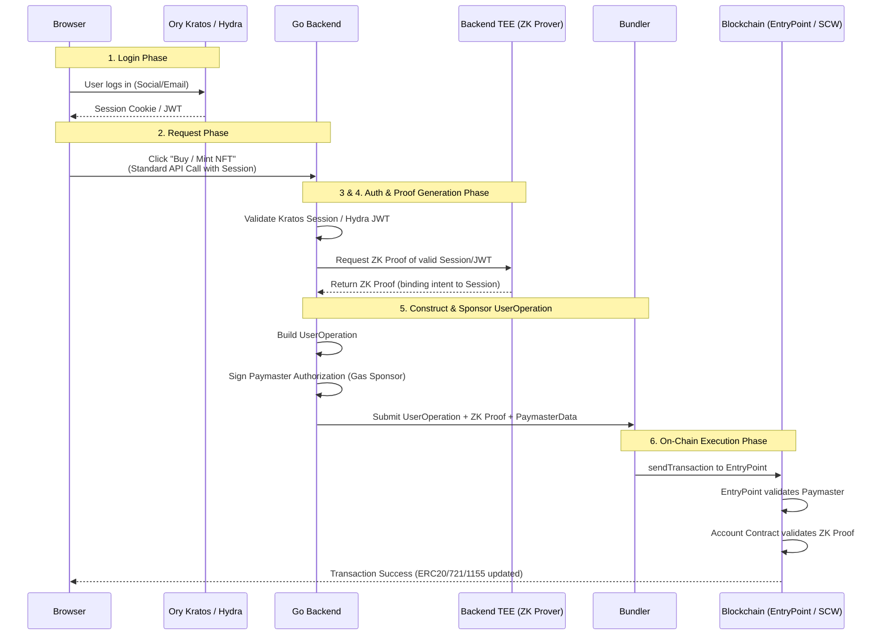
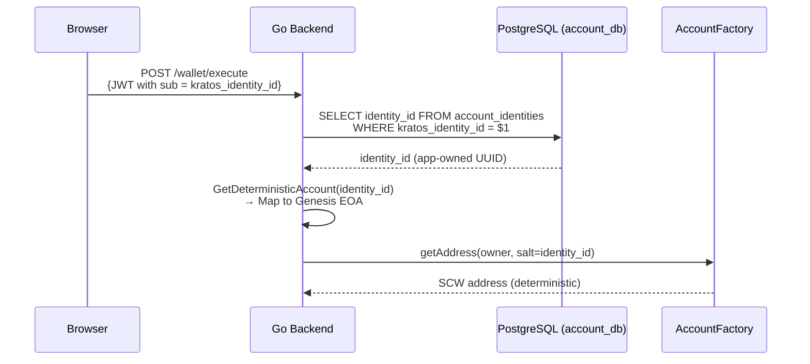

# OpenSpec: Web2 to Smart Wallet Bridge (ERC-4337)

## Status

Implemented ✅

## Context & Motivation (Why)

Currently, the Web3 onboarding experience is extremely unfriendly to average users. Traditional crypto wallets require users to manage **Seed Phrases** (Mnemonic words) and **Private Keys**. Most normal users are unfamiliar with this self-custodial model, leading to significant friction, high drop-off rates, and frequent permanent loss of assets when keys are forgotten or misplaced.

By integrating **Web2 Authentication (Social Media, Email)** with a **Web3 Smart Contract Wallet (ERC-4337)**, we can offer a frictionless "Web2.5" application experience:

1. Users authenticate via familiar methods (e.g., Google login, email OTP).
2. Users can easily recover their accounts using standard Web2 account recovery (e.g., "Forgot Password"), making asset retrieval significantly easier.
3. Users do **not** need to install any wallet browser extensions (like MetaMask) or manage private keys manually.
4. Gas fees are sponsored by the platform (via Paymaster), providing a seamless, gasless experience.

## Goals

- **Frictionless Authentication**: Support Login with Social Media, Email, and traditional Wallet Connect.
- **Invisible Execution**: Execute Web3 transactions (ERC-4337 `UserOperation`) purely via backend integration for Social/Email users (No wallet connection/signing popups needed).
- **Full Asset Compatibility**: Transactions and UI must natively support standard Ethereum asset classes:
  - **ERC-20** (Fungible Tokens, e.g., stablecoins, points)
  - **ERC-721** (Non-Fungible Tokens, e.g., avatars, passes)
  - **ERC-1155** (Multi-Tokens, e.g., gaming items, event tickets)

## High-Level Architecture

The bridge design connects the Auth stack (`Kratos/Hydra`) with the Smart Contract execution stack (`Geth/EntryPoint`) via a trusted Go Backend (`API/Bundler`). Identity resolution uses the application-owned `account_identities.identity_id` (not the Kratos UUID) as the deterministic salt for SCW address derivation.



## Component Responsibilities

| Environment          | Component              | Role / Responsibility                                                                                                                                                       |
| :------------------- | :--------------------- | :-------------------------------------------------------------------------------------------------------------------------------------------------------------------------- |
| **Frontend**         | Browser App            | Renders UI. Handles Kratos login redirect. Sends high-level intent (e.g., `POST /api/mint`) to the backend. DOES NOT hold private keys for Social users.                    |
| **Backend**          | Go Backend (API)       | Acts as the bridge. Verifies Kratos Web2 session/JWT. Constructs the ERC-4337 `UserOperation`.                                                                              |
| **Backend**          | Prover / TEE           | Generates a Zero-Knowledge Proof (ZK Proof) attesting that a valid JWT was presented for the specific API payload. Prevents JWT leaking to the blockchain.                  |
| **Backend**          | Paymaster (Service)    | Co-located with the API. Signs `paymasterAndData` authorizing the EntryPoint to deduct gas from the platform's deposited ETH balance.                                       |
| **Backend/On-Chain** | Native EOA Bundler     | Merged within the Go API `BundlerService`. Evaluates `UserOperation` payloads, encodes `handleOps` calldata, and broadcasts an authenticated Ethereum transaction natively. |
| **On-Chain**         | EntryPoint Contract    | ERC-4337 standard contract orchestrating validation and execution.                                                                                                          |
| **On-Chain**         | Account Contract (SCW) | The user's Smart Contract Wallet. Holds the user's ERC20/721/1155 assets. Its `validateUserOp` function verifies the backend-generated ZK Proof.                            |
| **On-Chain**         | Paymaster Contract     | Holds ETH vault. Reimburses the Bundler for the transaction gas fee after successful execution.                                                                             |

## Security & Privacy Considerations (Trust Model)

This architecture employs an **application-managed custody** (or semi-custodial) model for Social/Email logins:

1. **Authorization Binding**: To prevent replay attacks, the ZK Proof generated by the TEE **MUST** include the `UserOpHash` as a public input. It must prove: _"I hold a valid JWT for User X, and User X authorizes this specific `UserOpHash`"_.
2. **Backend Trust Assumption**: Because the Go Backend generates the ZK Proof on behalf of the user's API call, the user is fundamentally trusting the Backend/TEE not to forge transactions. This is standard and acceptable for "Web2.5" applications aiming for maximum UX smoothness.
3. **Session Revocation**: Using Kratos ensures that when a user clicks "Logout" or resets their password, the session ends immediately, invalidating any future ZK proofs relying on that session.

## Identity Mapping (SCW Derivation Key)

> [!IMPORTANT]
> The SCW address derivation MUST use `account.account_identities.identity_id` — NOT `kratos.identities.id` or `accounts.account_id`.

### Why `identity_id`?

| Approach                            | Source                 | Risk                                                 |
| :---------------------------------- | :--------------------- | :--------------------------------------------------- |
| ~~`kratos.identities.id`~~          | External (Ory Kratos)  | Kratos replaced/reset → **SCW mappings lost**        |
| ~~`accounts.account_id`~~           | Internal (grouping PK) | Account merge → **SCW address changes, assets lost** |
| ✅ `account_identities.identity_id` | Internal (identity PK) | Immutable PK, never changes on link/merge            |

### Table Roles

```
accounts.account_id          → 人的 grouping（UI/Dashboard 用，link 時改 FK）
account_identities.identity_id → SCW derivation salt（永不改變，資產安全）
account_identities.kratos_identity_id → Kratos cross-reference（auth lookup）
```

### Resolution Flow

When a user authenticates and requests a transaction:



### Database Relationship

```
kratos.identities
  └─ id (UUID)                     ← external, used in JWT `sub`
        │
        ▼ (lookup via kratos_identity_id)
account.account_identities
  ├─ identity_id (UUID, PK)        ← SCW derivation salt (immutable)
  ├─ account_id (UUID, FK)         ← grouping (changed on link/merge)
  ├─ kratos_identity_id (UUID)     ← Kratos cross-reference
  └─ provider_id                   ← "email" | "eoa" | "google"
        │
        ▼ (FK)
account.accounts
  └─ account_id (UUID, PK)        ← grouping only (no kratos_uuid)
```

### Link Behavior

- **Link**: Only `account_identities.account_id` FK changes → SCW address unchanged ✅
- **Unlink**: FK reverted → SCW address unchanged ✅
- **Each identity** derives its own unique SCW → no asset migration needed

### Profile UI Requirements

The Dashboard Profile page MUST display the resolved `identity_id` for **all** auth methods:

| Auth Method          | Profile Section | Identity Source                                     | Fields Displayed             |
| :------------------- | :-------------- | :-------------------------------------------------- | :--------------------------- |
| **SIWE** (EIP-4361)  | Wallet Details  | `account_identities` WHERE `provider_id = 'eoa'`    | ADDRESS, SCW, AUTH, IDENTITY |
| **Gmail** (OIDC)     | Account Details | `account_identities` WHERE `provider_id = 'google'` | JWT claims + SCW + IDENTITY  |
| **Email** (Password) | Account Details | `account_identities` WHERE `provider_id = 'email'`  | JWT claims + SCW + IDENTITY  |

The `IDENTITY` field displays `account_identities.identity_id` — the app-owned UUID used as the SCW derivation salt. This is distinct from the JWT `sub` claim (which is the Kratos UUID).

> [!NOTE]
> Until the backend API resolves `identity_id` from `kratos_identity_id`, the frontend falls back to displaying `sub` (Kratos UUID). Once the identity resolution endpoint is implemented, all profiles will show the true app-owned `identity_id`.

## Asset Handling Patterns

Transactions built by the backend must correctly target standard token interfaces:

- **Deploy Contract**: `createToken(name, symbol, decimals, initialSupply)` or `createNFT(name, symbol, baseURI)` via the `Web3LabERC*Factory` proxy instances.
- **ERC-20**: `transfer(to, amount)` or `approve(spender, amount)` payloads scoped to the user's deployed Token Address.
- **ERC-721**: `safeTransferFrom(from, to, tokenId)` payloads.
- **ERC-1155**: `safeTransferFrom(from, to, id, amount, data)` payloads.

Because the user owns a Smart Contract Wallet, they can also utilize **Batch Execution** (e.g., executing an `approve` and `transferFrom` atomically in a single `UserOperation`), further improving speed and user experience.

## Operational Notes

> **Important**: After any Geth chain reset, the following steps are mandatory:

1. **Contract Address Synchronization**: Re-run the deployment script (`contracts/scripts/deploy.js`). Copy the resulting addresses from `contracts/deployments.json` into `deployments/kustomize/api/overlays/minikube/configmap-config.yaml` and restart the `web3-api` pod.
2. **Paymaster Funding**: Deposit ETH into the **EntryPoint** contract for the Paymaster using `entryPoint.depositTo(paymasterAddress)`. Sending ETH directly to the Paymaster contract address does **not** fund the gas sponsorship pool.
3. **Blockscout DB Reset**: Clear the Blockscout Postgres database (`DROP SCHEMA public CASCADE; CREATE SCHEMA public;`) and restart the backend to avoid stale block references causing `ContractCode` fetcher crash loops.
4. **EntryPoint Consistency**: All contracts (AccountFactory, Paymaster, Account Implementations) must reference the **same** `EntryPoint` address. A mismatch causes `Sender not EntryPoint` reverts during `validatePaymasterUserOp`.
